# Empezando de cero

## Empieza con una funcionalidad, no con un diseño de página

Cuando empiezas el diseño de una nueva idea de aplicación, ¿qué diseñas primero? Si es la barra de navegación en la parte superior de la página, estás cometiendo un error.

La forma más fácil de frustrarte y quedarte atascado al trabajar en un nuevo diseño es empezar intentando "diseñar la aplicación". Cuando la mayoría de las personas piensa en "diseñar la aplicación", en realidad está pensando en el armazón (shell).

- ¿Debería tener una barra de navegación superior o una barra lateral?
- ¿Los elementos de navegación deberían ir a la izquierda o a la derecha?
- ¿El contenido de la página debería estar dentro de un contenedor o ocupar todo el ancho?
- ¿Dónde debería ir el logo?

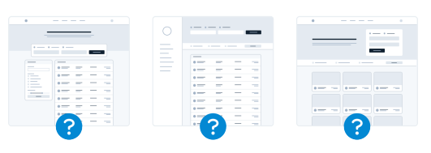

La cuestión es que una "aplicación" es, en realidad, una colección de funcionalidades. Antes de haber diseñado algunas funcionalidades, ni siquiera tienes la información necesaria para tomar una decisión sobre cómo debería funcionar la navegación. ¡Con razón es frustrante!

En lugar de empezar con el armazón, empieza con una parte de funcionalidad real.

Por ejemplo, digamos que estás construyendo un servicio de reserva de vuelos. Podrías empezar con una funcionalidad como "buscar un vuelo".

Tu interfaz necesitará:

- Un campo para la ciudad de origen
- Un campo para la ciudad de destino
- Un campo para la fecha de salida
- Un campo para la fecha de regreso
- Un botón para realizar la búsqueda

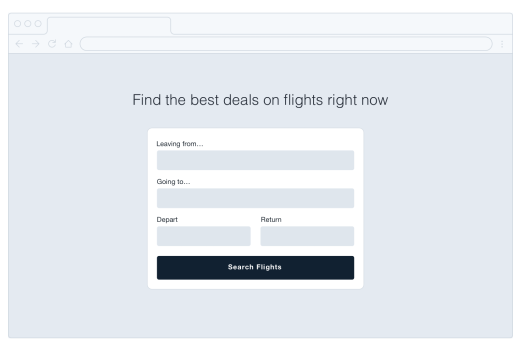

Empieza con eso. De hecho, puede que ni siquiera necesites todo lo demás — así le hizo Google.

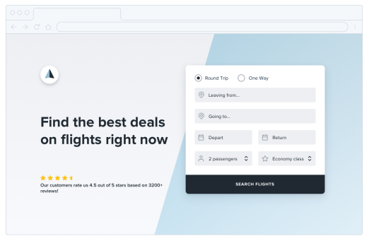

## Los detalles vienen después

En las primeras etapas del diseño de una nueva funcionalidad, es importante que no te quedes atascado tomando decisiones de bajo nivel sobre cosas como las tipografías, las sombras, los iconos, etc.

Todo eso eventualmente importará, pero no importa ahora mismo.

Si te cuesta ignorar los detalles cuando trabajas en un entorno de alta fidelidad como el navegador o tu herramienta de diseño favorita, un truco que a Jason Fried, de Basecamp, le gusta usar es diseñar en papel usando un marcador grueso (Sharpie).

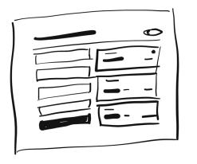

Obsesionarse con los pequeños detalles no es posible con un Sharpie, por lo que puede ser una excelente manera de explorar rápidamente un montón de ideas diferentes de maquetación.

### Retén el color

Incluso cuando ya estés listo para refinar una idea en mayor fidelidad, resiste la tentación de introducir color de inmediato. Al diseñar en escala de grises, te obligas a usar el espaciado, el contraste y el tamaño para hacer todo el trabajo pesado.

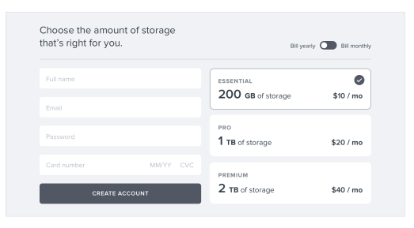

Es un poco más desafiante, pero terminarás con una interfaz más clara y con una jerarquía sólida que será fácil de realzar con color más adelante.

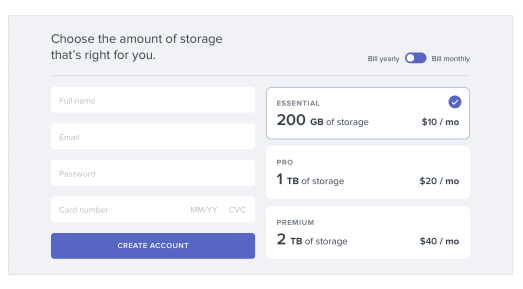

### No inviertas de más

El objetivo principal de diseñar en baja fidelidad es poder avanzar rápido, de modo que puedas empezar a construir el producto real lo antes posible.

Los bocetos y los wireframes son desechables — los usuarios no pueden hacer nada con maquetas estáticas. Úsalos para explorar tus ideas y déjalos atrás cuando hayas tomado una decisión.

## No diseñes demasiado

No necesitas diseñar cada funcionalidad de una aplicación antes de pasar a la implementación; de hecho, es mejor que no lo hagas. 

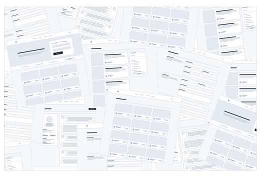

Descubrir cómo debería interactuar cada funcionalidad de un producto y cómo debería verse cada caso límite es realmente difícil, especialmente en abstracto.

- ¿Cómo debería verse esta pantalla si el usuario tiene 2000 contactos?
- ¿Dónde debería ir el mensaje de error en este formulario?
- ¿Cómo debería verse este calendario cuando hay dos eventos programados a la misma hora?

Te estás preparando para la frustración al intentar resolver este tipo de cosas usando solo una herramienta de diseño y tu imaginación.

### Trabaja en ciclos

En lugar de diseñar todo por adelantado, trabaja en ciclos cortos. Comienza diseñando una versión simple de la siguiente funcionalidad que quieras construir.

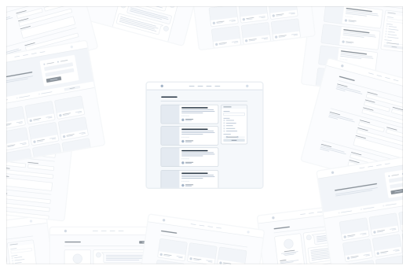

Una vez que estés satisfecho con el diseño básico, hazlo realidad.

Probablemente te encontrarás con alguna complejidad inesperada en el camino, pero de eso se trata — es mucho más fácil corregir problemas de diseño en una interfaz que realmente puedes usar que imaginar cada caso límite por adelantado.

Itera sobre el diseño funcional hasta que no queden más problemas por resolver, luego salta de nuevo al modo diseño y empieza a trabajar en la siguiente funcionalidad.

No te abrumes trabajando en abstracto. Construye el producto real lo antes posible para que tu imaginación no tenga que hacer todo el trabajo pesado.

### Sé un pesimista

No impliques en tus diseños funcionalidades que no estés listo para construir.

Por ejemplo, digamos que estás trabajando en un sistema de comentarios para una herramienta de gestión de proyectos. Sabes que algún día te gustaría que los usuarios pudieran adjuntar archivos a sus comentarios, así que incluyes una sección de adjuntos en tu diseño.

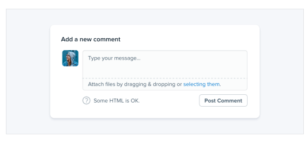

Te adentras en la implementación solo para descubrir que dar soporte a los archivos adjuntos va a ser mucho más trabajo del que anticipabas.

No tienes forma de terminar eso ahora mismo, así que todo el sistema de comentarios queda en segundo plano mientras te encargas de otras prioridades.

La cuestión es que un sistema de comentarios sin adjuntos habría sido mejor que ningún sistema de comentarios en absoluto, pero como planeaste incluirlos desde el primer día, no tienes nada que puedas lanzar.

Cuando estés diseñando una nueva funcionalidad, espera que sea difícil de construir.

Diseñar la versión más pequeña y útil que puedas lanzar reduce considerablemente ese riesgo.

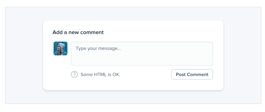

Si parte de una funcionalidad es un "extra opcional", diseña esa parte más tarde. Construye primero la versión simple y siempre tendrás algo a lo que recurrir.

## Elige una personalidad

Cada diseño tiene algún tipo de personalidad. Un sitio de banca en línea puede intentar comunicar seguridad y profesionalismo, mientras que una nueva startup a la moda puede tener un diseño que se sienta divertido y juguetón.

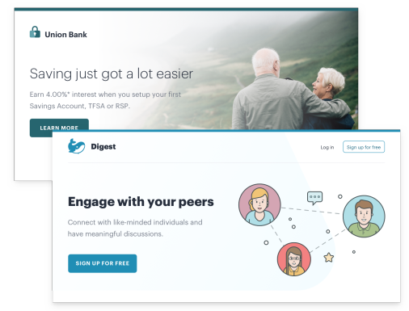

En la superficie, darle a un diseño una personalidad en particular puede sonar abstracto e impreciso, pero gran parte de esto está determinado por unos pocos factores sólidos y concretos.

### Elección de fuente

La tipografía juega un papel enorme en determinar cómo se siente un diseño.

Si quieres un aspecto elegante o clásico, quizás quieras incorporar una tipografía serif en tu diseño:

Para un aspecto juguetón, podrías usar una sans serif redondeada:

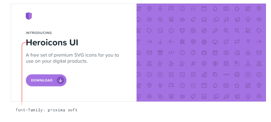

Si buscas un aspecto más sobrio, o quieres depender de otros elementos para aportar la personalidad, una sans serif neutra funciona genial:

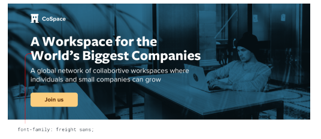

### Color

Hay mucha ciencia sobre la psicología del color, pero en la práctica, realmente solo necesitas prestar atención a cómo te hacen sentir los diferentes colores.

El azul es seguro y familiar — nadie nunca se queja del azul:

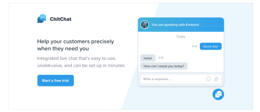

El dorado podría decir "caro" y "sofisticado":

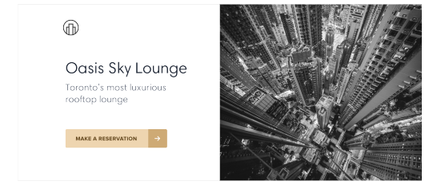

El rosa es un poco más divertido, y no tan serio:

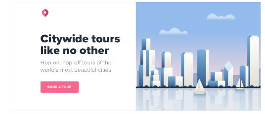

Si bien elegir colores usando solo psicología no es súper práctico — mucho de esto es simplemente sobre qué te parece que se ve bien — puede ser útil pensarlo cuando estás tratando de entender por qué crees que un color es el adecuado.

### Radio de borde

Por pequeño que suene el detalle, si redondeas las esquinas en tu diseño, y cuánto lo haces, puede tener un gran impacto en la sensación general.

Un radio de borde pequeño es bastante neutro, y por sí solo no comunica mucha personalidad:

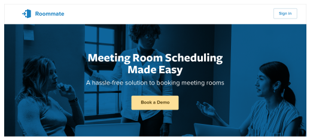

Un radio de borde grande empieza a sentirse más juguetón:

…mientras que ningún radio de borde se siente mucho más serio o formal:

Sea lo que sea que elijas, es importante mantener la consistencia. Mezclar esquinas cuadradas con esquinas redondeadas en la misma interfaz casi siempre se ve peor que quedarse con una u otra.

### Lenguaje

Aunque no es una técnica de diseño visual per se, las palabras que usas en una interfaz tienen una influencia masiva en la personalidad general.

Usar un tono menos personal puede sentirse más oficial o profesional:

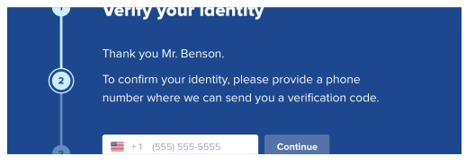

…mientras que usar un lenguaje más amigable y casual hace que un sitio se sienta, bueno, más amigable:

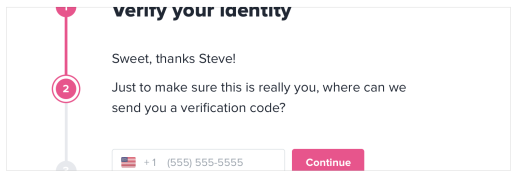

Las palabras están por todas partes en una interfaz de usuario, y elegir las correctas es tan importante (si no más) como elegir el color o la tipografía adecuados.

### Decidir lo que realmente quieres

Muchas veces probablemente solo tendrás una corazonada sobre la personalidad que buscas. Pero si no es así, una excelente manera de simplificar la decisión es echar un vistazo a otros sitios que usan las personas a las que quieres llegar.

Si son en su mayoría bastante "serios", quizás así debería verse tu sitio también. Si son más juguetones con un toque de humor, quizás esa sea una mejor dirección a tomar.

Solo procura no tomar demasiado prestado de los competidores directos, no querrás parecer una versión de segunda categoría de otra cosa.

## Limita tus opciones

Tener millones de colores y miles de fuentes entre las que elegir puede sonar bien en teoría, pero en la práctica suele ser una maldición paralizante.

Y no se trata solo de fuentes y colores — puedes perder el tiempo fácilmente atormentándote por casi cualquier decisión menor de diseño.

- ¿Este texto debería ser de 12px o 13px?
- ¿Esta sombra de caja debería tener una opacidad del 10% o del 15%?
- ¿Este avatar debería medir 24px o 25px de alto?
- ¿Debería usar un peso de fuente medium para este botón o semibold?
- ¿Este título debería tener un margen inferior de 18px o 20px?

Cuando diseñas sin restricciones, tomar decisiones es una tortura porque siempre habrá más de una opción correcta.

Por ejemplo, estos botones tienen todos diferentes colores de fondo, pero es casi imposible distinguir la diferencia entre ellos con solo mirarlos.

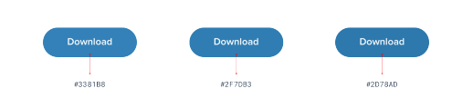

¿Cómo se supone que vas a tomar una decisión con confianza si ninguna de estas opciones sería realmente mala?

### Define sistemas por adelantado

En lugar de elegir valores a mano de un grupo ilimitado cada vez que necesites tomar una decisión, comienza con un conjunto más pequeño de opciones.

No recurras al selector de colores cada vez que necesites elegir un nuevo tono de azul — elige entre un conjunto de 8-10 tonos escogidos de antemano. 

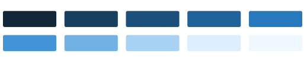

De manera similar, no ajustes el tamaño de fuente un píxel a la vez hasta que se vea perfecto.

Define una escala tipográfica restrictiva por adelantado y úsala para tomar cualquier decisión futura sobre tamaños de fuente.

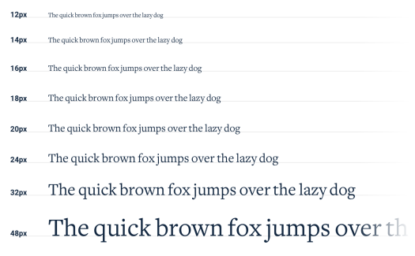

Cuando construyes sistemas como este, solo tienes que hacer el trabajo duro de elegir los valores iniciales una vez, en lugar de cada vez que diseñas una nueva pieza de UI.

Es un poco más de trabajo por adelantado, pero vale la pena — te ahorrará un montón de fatiga de decisiones más adelante.

### Diseñar por proceso de eliminación

Cuando diseñas usando un conjunto restringido de valores, tomar decisiones es mucho más fácil porque hay muchas menos opciones "correctas".

Por ejemplo, digamos que estás tratando de elegir un tamaño para un icono. Has definido una escala de tamaños por adelantado donde tus únicas opciones de tamaño pequeño a mediano son 12px, 16px, 24px y 32px.

Para elegir la mejor opción, comienza haciendo una suposición de cuál se verá mejor, quizás 16px. Luego prueba los valores a ambos lados (12px y 24px) para comparar.

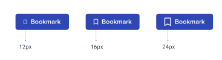

Lo más probable es que dos de esas opciones parezcan claramente malas. Si son las opciones de los extremos, ya terminaste — la opción del medio es la única buena elección.

Si una de las opciones exteriores es la que mejor se ve, haz otra comparación usando esa opción como valor "medio" y asegúrate de que no exista una opción mejor.

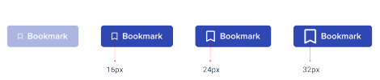

Este enfoque funciona para cualquier cosa en la que hayas definido un sistema. Cuando te limitas a un conjunto de opciones que se ven notablemente diferentes entre sí, elegir la mejor es pan comido.

### Sistematiza todo

Cuantos más sistemas tengas establecidos, más rápido podrás trabajar y menos dudarás de tus propias decisiones.

Querrás tener sistemas para cosas como:

- Tamaño de fuente
- Peso de la fuente
- Altura de línea
- Color
- Margen
- Padding
- Ancho
- Alto
- Sombras de caja
- Radio de borde
- Ancho de borde
- Opacidad

…y cualquier otra cosa con la que te encuentres donde sientas que te estás demorando demasiado en una decisión de diseño de bajo nivel.

No tienes que definir todo esto por adelantado, solo asegúrate de abordar el diseño con una mentalidad centrada en sistemas. Busca oportunidades para introducir nuevos sistemas a medida que tomas nuevas decisiones, y trata de evitar tener que tomar la misma decisión menor dos veces.

Diseñar con sistemas será un tema recurrente a lo largo de este libro, y en capítulos posteriores hablaremos sobre cómo construir muchos de estos sistemas con mayor detalle.

