# La jerarquia es todo

## No todos los elementos son iguales

Cuando piensas en el diseño visual como "estilizar las cosas para que se vean bien", es fácil entender por qué podría parecer difícil de lograr sin talento artístico innato. Pero resulta que uno de los mayores factores para hacer que algo "se vea bien" no tiene nada que ver con el estilo superficial.

La jerarquía visual se refiere a qué tan importantes aparecen los elementos de una interfaz en relación unos con otros, y es la herramienta más eficaz que tienes para hacer que algo se sienta "diseñado".

Cuando todo en una interfaz compite por atención, se siente ruidoso y caótico, como un gran muro de contenido donde no está claro qué es lo que realmente importa. 

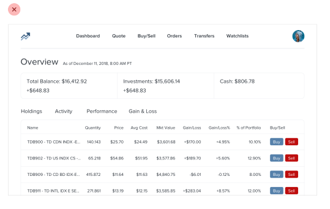

Cuando deliberadamente restas énfasis a la información secundaria y terciaria, y te esfuerzas por resaltar los elementos que son más importantes, el resultado es inmediatamente más agradable, incluso aunque el esquema de colores, la elección de tipografía y el diseño no hayan cambiado.

Entonces, ¿cómo haces que esto realmente suceda? En los siguientes capítulos, cubriremos una serie de estrategias específicas que puedes usar para introducir jerarquía en tus diseños.

## El tamaño no lo es todo

Confiarse demasiado en el tamaño de la fuente para controlar tu jerarquía es un error; a menudo lleva a contenido primario demasiado grande y contenido secundario demasiado pequeño.

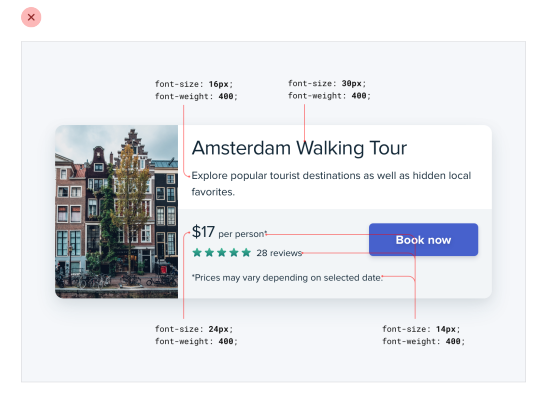

En lugar de dejarle todo el trabajo pesado solo al tamaño de la fuente, intenta usar el peso de la fuente o el color para hacer el mismo trabajo.

Por ejemplo, hacer un elemento primario más audaz te permite usar un tamaño de fuente más razonable y, a menudo, hace un mejor trabajo al comunicar su importancia de todos modos. 

Del mismo modo, usar un color más suave para el texto de apoyo, en lugar de un tamaño de fuente diminuto, deja claro que el texto es secundario sacrificando menos en legibilidad.

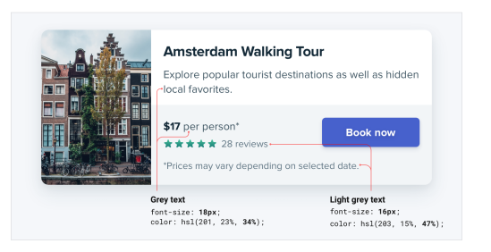

Intenta quedarte con dos o tres colores:

- Un color oscuro para el contenido primario (como el titular de un artículo)
- Un gris para el contenido secundario (como la fecha en que se publicó un artículo)
- Un gris más claro para el contenido terciario (tal vez el aviso de derechos de autor en un pie de página)

Del mismo modo, dos pesos de fuente suelen ser suficientes para el trabajo de UI:

- Un peso de fuente normal (400 o 500 dependiendo de la fuente) para la mayor parte del texto
- Un peso de fuente más pesado (600 o 700) para el texto que quieres enfatizar

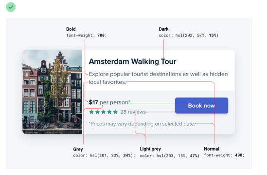

Mantente alejado de los pesos de fuente por debajo de 400 para el trabajo de UI; pueden funcionar para titulares grandes, pero son demasiado difíciles de leer en tamaños más pequeños. Si estás considerando usar un peso más claro para restar énfasis a algún texto, usa un color más claro o un tamaño de fuente más pequeño en su lugar.

## No uses texto gris sobre fondos de color

Hacer el texto de un gris más claro es una excelente manera de restarle énfasis sobre fondos blancos, pero no se ve tan bien sobre fondos de color. 

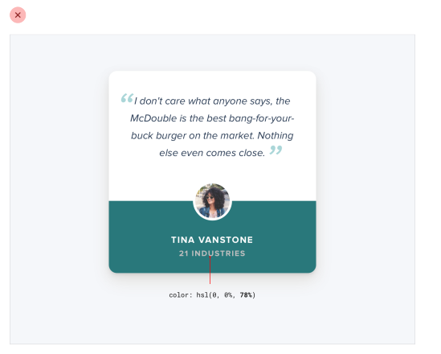

Eso se debe a que el efecto que realmente estamos viendo con el gris sobre blanco es un contraste reducido.

Acercar el texto al color del fondo es lo que realmente ayuda a crear jerarquía, no hacerlo gris claro.

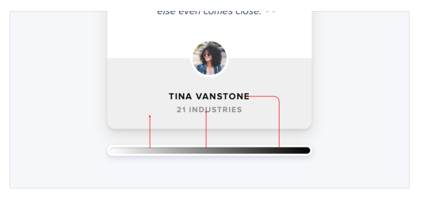

Podrías pensar que la forma más fácil de lograrlo es usar texto blanco y reducir la opacidad. 

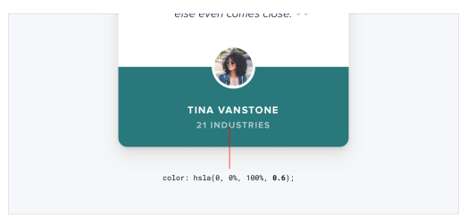

Si bien esto reduce el contraste, a menudo resulta en un texto que se ve opaco, deslavado y, a veces, incluso deshabilitado.

Peor aún, usar este enfoque sobre una imagen o patrón significa que el fondo se verá a través del texto.

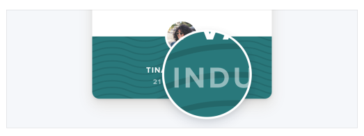

Un mejor enfoque es elegir manualmente un nuevo color, basado en el color del fondo. 

Elige un color con el mismo tono (hue) y ajusta la saturación y la luminosidad hasta que se vea bien para ti.

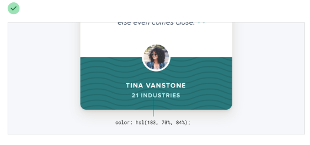

Elegir a mano un color de esta manera facilita reducir el contraste sin que el texto se vea desvanecido.

## Enfatiza al restar énfasis

A veces te encontrarás con una situación donde el elemento principal de una interfaz no se destaca lo suficiente, pero no hay nada que puedas añadirle para darle el énfasis que necesita.

Por ejemplo, a pesar de intentar hacer que este elemento de navegación activo "resalte" dándole un color diferente, todavía no se destaca realmente en comparación con los elementos inactivos.

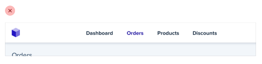

Cuando te encuentres con situaciones como esta, en lugar de intentar enfatizar aún más el elemento al que quieres llamar la atención, descubre cómo puedes restarle énfasis a los elementos que compiten con él.

En este ejemplo, podrías hacerlo dándole a los elementos inactivos un color más suave para que se ubiquen más en el fondo.

Puedes aplicar este pensamiento a partes más grandes de una interfaz también. Por ejemplo, si una barra lateral siente que compite con tu área de contenido principal, no le des un color de fondo; deja que el contenido se ubique directamente sobre el fondo de la página.

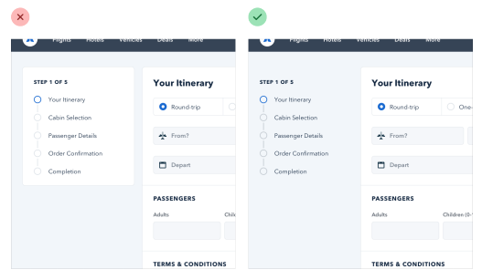

## Las etiquetas son un último recurso

Deja el tridente de la accesibilidad a un lado; esto no trata sobre formularios.

Al presentar datos al usuario (especialmente datos de la base de datos), es fácil caer en la trampa de mostrarlos usando un formato ingenuo de etiqueta: valor. 

El problema con este enfoque es que dificulta presentar los datos con cualquier tipo de jerarquía; cada dato recibe el mismo énfasis.

### Puede que no necesites una etiqueta en absoluto

En muchas situaciones, puedes saber qué es un dato solo por su formato.

Por ejemplo, janedoe@example.com es una dirección de correo electrónico, (555) 765-4321 es un número de teléfono y $19.99 es un precio.

Cuando el formato no es suficiente, a menudo lo es el contexto. Cuando ves la frase "Atención al cliente" listada debajo del nombre de alguien en un directorio de empleados, no necesitas una etiqueta para hacer la conexión de que ese es el departamento en el que trabaja la persona.

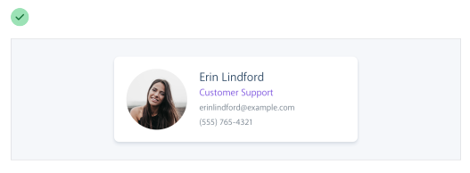

Cuando puedes presentar datos sin etiquetas, es mucho más fácil enfatizar información importante o de identificación, haciendo la interfaz más fácil de usar y, al mismo tiempo, haciéndola sentir más "diseñada".

### Combina etiquetas y valores

Incluso cuando un dato no es completamente claro sin una etiqueta, a menudo puedes evitar añadir una etiqueta agregando texto aclaratorio al valor.

Por ejemplo, si necesitas mostrar el inventario en una interfaz de comercio electrónico, en lugar de "En stock: 12", prueba algo como "Quedan 12 en stock". 

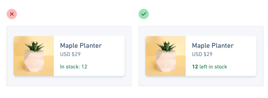

Si estás construyendo una aplicación inmobiliaria, algo como "Dormitorios: 3" podría simplemente convertirse en "3 dormitorios".

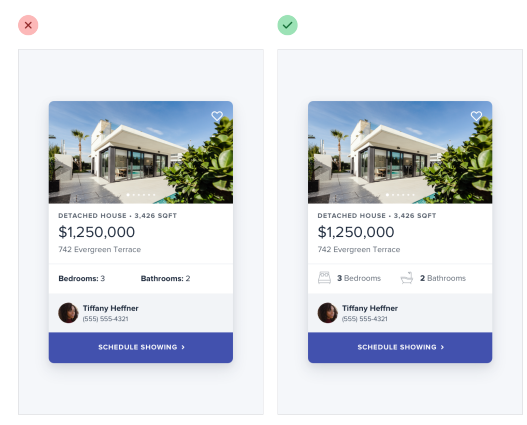

Cuando puedes combinar etiquetas y valores en una sola unidad, es mucho más fácil darle a cada dato un estilo significativo sin sacrificar claridad.

### Las etiquetas son secundarias

A veces realmente necesitas una etiqueta; por ejemplo, cuando estás mostrando múltiples piezas de datos similares que necesitan ser fácilmente escaneables, como en un panel de control (dashboard). En estas situaciones, añade la etiqueta, pero trátala como contenido de apoyo. El dato en sí es lo que importa, la etiqueta solo está ahí para dar claridad.

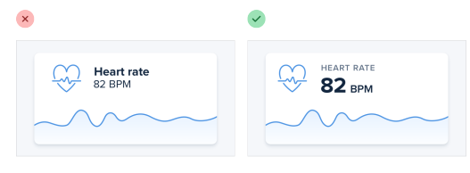

Réstale énfasis a la etiqueta haciéndola más pequeña, reduciendo el contraste, usando un peso de fuente más ligero, o alguna combinación de los tres.

### Cuándo enfatizar una etiqueta

Si estás diseñando una interfaz donde sabes que el usuario estará buscando la etiqueta, podría tener sentido enfatizar la etiqueta en lugar del dato. 

Este suele ser el caso en páginas densas en información, como las especificaciones técnicas de un producto.

Si un usuario está tratando de encontrar las dimensiones de un teléfono inteligente, probablemente esté escaneando la página en busca de palabras como "profundidad", no "7.6mm". 

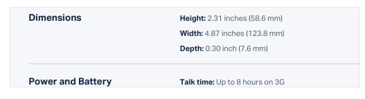

No restes énfasis al dato demasiado en estos escenarios; sigue siendo información importante. Simplemente usar un color más oscuro para la etiqueta y un color ligeramente más claro para el valor suele ser suficiente.

## Separa la jerarquía visual de la jerarquía del documento

Es importante usar marcado semántico cuando construyes para la web, lo que significa que a menudo usarás etiquetas de encabezado como h1, h2 o h3 si decides añadir un título a parte de una interfaz.

Por defecto, los navegadores web asignan tamaños de fuente progresivamente más pequeños a los elementos de encabezado, así que un h1 es bastante grande y un h6 es bastante pequeño. Esto puede ser útil para contenido con estilo de documento como artículos o documentación, pero puede fomentar algunas malas decisiones en las UI de aplicaciones.

Usar una etiqueta h1 para añadir un título como Cambiar cuenta a una página tiene mucho sentido semánticamente, pero como estamos entrenados para creer que los elementos h1 deben ser grandes, es fácil caer en la trampa de hacer esos títulos más grandes de lo que realmente necesitan ser.

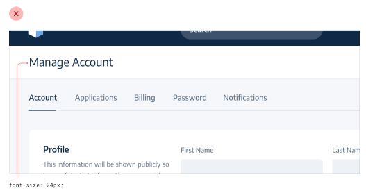

Muchas veces, los títulos de sección actúan más como etiquetas que como encabezados; son contenido de apoyo, no deberían robar toda la atención.

Usualmente el contenido de esa sección debería ser el foco, no el título. Eso significa que, muchas veces, los títulos en realidad deberían ser bastante pequeños.

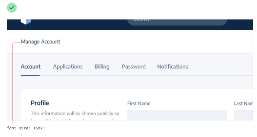

Llevado al extremo, incluso podrías incluir títulos de sección en tu marcado por razones de accesibilidad, pero ocultarlos completamente visualmente porque el contenido habla por sí mismo.

No dejes que el elemento que estás usando influencie cómo eliges estilizarlo; elige elementos con fines semánticos y estilízalos como necesites para crear la mejor jerarquía visual.

## Equilibra el peso y el contraste

La razón por la que el texto en negrita se siente enfatizado en comparación con el texto regular es que el texto en negrita cubre más área de superficie; en la misma cantidad de espacio, se usan más píxeles para el texto que para el fondo.

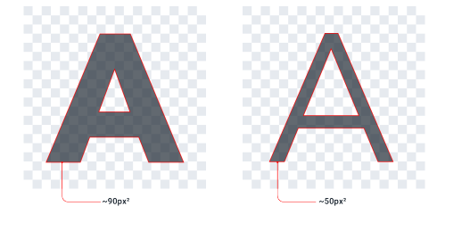

Entonces, ¿por qué es esto interesante? Pues resulta que la relación entre el área de superficie y la jerarquía tiene implicaciones en otros elementos de una UI también.

### Usa el contraste para compensar el peso

Uno de los lugares donde entender esta relación se vuelve importante es al trabajar con iconos.

Al igual que el texto en negrita, los iconos (especialmente los sólidos) generalmente son bastante "pesados" y cubren mucha área de superficie. Como resultado, cuando pones un icono junto a texto, el icono tiende a sentirse enfatizado.

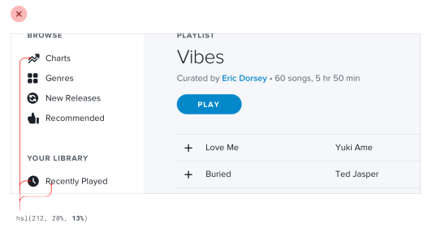

A diferencia del texto, no hay forma de cambiar el "peso" de un icono, así que para crear equilibrio necesita ser restado de énfasis de alguna otra manera.

Una forma simple y efectiva de hacer esto es reducir el contraste del icono dándole un color más suave. 

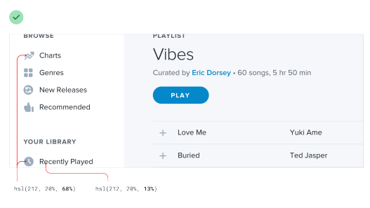

Esto funciona en cualquier lugar donde necesites equilibrar elementos que tienen pesos diferentes. Reducir el contraste funciona como un contrapeso, haciendo que los elementos más pesados se sientan más ligeros aunque el peso no haya cambiado.

### Usa el peso para compensar el contraste

Así como reducir el contraste ayuda a restar énfasis a los elementos pesados, aumentar el peso es una excelente manera de añadir un poco de énfasis a los elementos de bajo contraste.

Esto es útil cuando cosas como bordes finos de 1px son demasiado sutiles usando un color suave, pero oscurecer el color hace que el diseño se sienta áspero y ruidoso. 

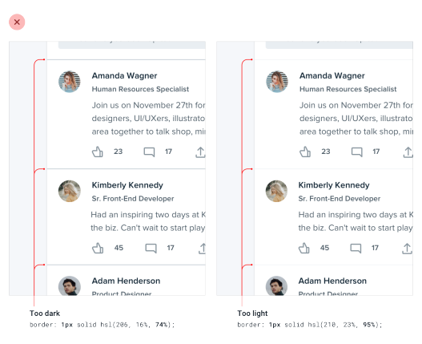

Hacer el borde un poco más pesado aumentando el ancho ayuda a enfatizarlo sin perder el aspecto más suave.

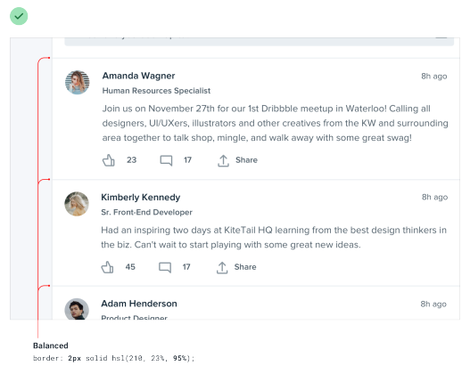

## La semántica es secundaria

Cuando hay múltiples acciones que un usuario puede tomar en una página, es fácil caer en la trampa de diseñar esas acciones basándose puramente en la semántica. 

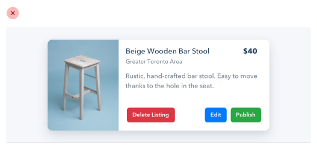

La semántica es una parte importante del diseño de botones, pero eso no significa que puedas olvidarte de la jerarquía.

Cada acción en una página se ubica en alguna parte de una pirámide de importancia. La mayoría de las páginas solo tienen una acción primaria verdadera, un par de acciones secundarias menos importantes y algunas acciones terciarias que se usan rara vez.

Al diseñar estas acciones, es importante comunicar su lugar en la jerarquía.

- Las acciones primarias deberían ser obvias. Los colores de fondo sólidos y de alto contraste funcionan muy bien aquí.
- Las acciones secundarias deberían ser claras pero no prominentes. Los estilos de contorno (outline) o los colores de fondo de menor contraste son excelentes opciones.
- Las acciones terciarias deberían ser descubribles pero discretas. Estilizar estas acciones como enlaces suele ser el mejor enfoque.

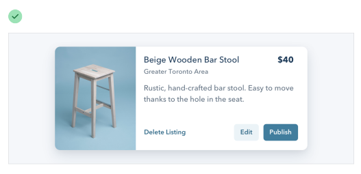

Cuando tomas un enfoque de jerarquía primero al diseñar las acciones de una página, el resultado es una UI mucho menos ocupada que comunica más claramente.

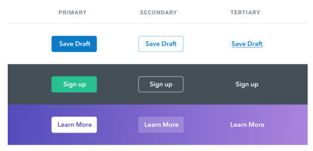

### Acciones destructivas

Ser destructivas o de alta severidad no significa automáticamente que un botón deba ser grande, rojo y en negrita.

Si una acción destructiva no es la acción primaria de la página, podría ser mejor darle un tratamiento de botón secundario o terciario. 

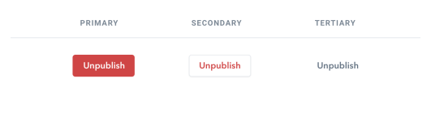

Combina esto con un paso de confirmación donde la acción destructiva sí sea la acción primaria, y aplica el estilo grande, rojo y en negrita ahí.

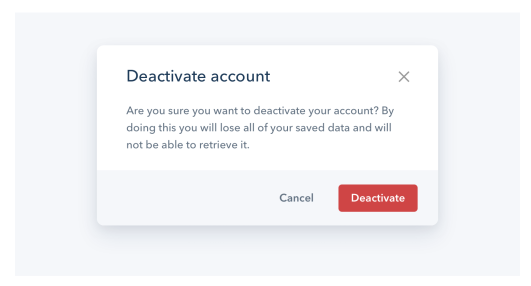

