# Disposicion y espaciado

## Empieza con demasiado espacio en blanco

Una de las formas más fáciles de limpiar un diseño es simplemente darle a cada elemento un poco más de espacio para respirar. 

Suena bastante simple, ¿no? Entonces, ¿por qué no lo hacemos normalmente?

### El espacio en blanco debería eliminarse, no añadirse

Al diseñar para la web, el espacio en blanco casi siempre se añade a un diseño — si algo se ve un poco apretado, añades un poco de margen o padding hasta que las cosas se vean mejor.

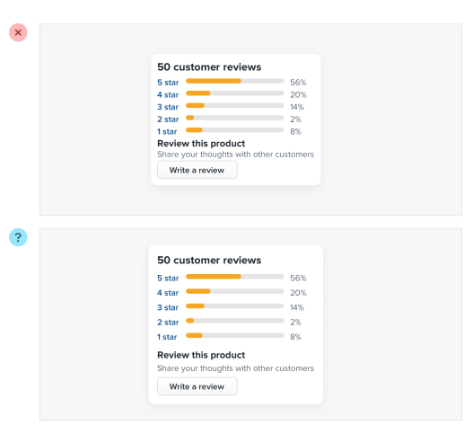

El problema con este enfoque es que los elementos solo reciben la cantidad mínima de espacio para respirar necesaria para no verse activamente mal. Para que algo realmente se vea genial, generalmente necesitas más espacio en blanco.

Un mejor enfoque es empezar dándole a algo demasiado espacio, y luego eliminarlo hasta que estés satisfecho con el resultado. 

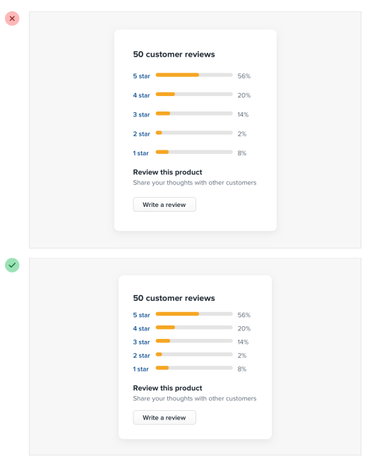

Podrías pensar que terminarías con demasiado espacio en blanco de esta manera, pero en la práctica, lo que puede parecer "un poco demasiado" cuando te enfocas en un elemento individual termina siendo más cercano a "lo justo" en el contexto de una UI completa.

## Las UI densas tienen su lugar

Mientras que las interfaces con mucho espacio para respirar casi siempre se sienten más limpias y simples, ciertamente hay situaciones donde tiene sentido que un diseño sea mucho más compacto.

Por ejemplo, si estás diseñando algún tipo de panel de control (dashboard) donde mucha información necesita ser visible a la vez, empaquetar esa información para que todo quepa en una sola pantalla podría valer la pena aunque el diseño se sienta más ocupado.

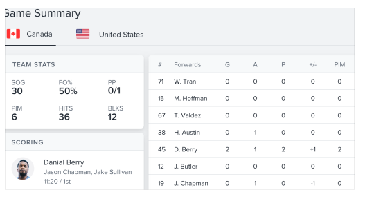

Lo importante es que esto sea una decisión deliberada en lugar de ser simplemente la opción por defecto. Es mucho más obvio cuándo necesitas eliminar espacio en blanco que cuándo necesitas añadirlo.

## Establece un sistema de espaciado y tamaño

No deberías estar buscando minuciosamente entre 120px y 125px al intentar decidir el tamaño perfecto para un elemento en tu UI.

Probar dolorosamente valores arbitrarios de un píxel a la vez te va a frenar drásticamente en el mejor de los casos, y crear diseños feos e inconsistentes en el peor. 

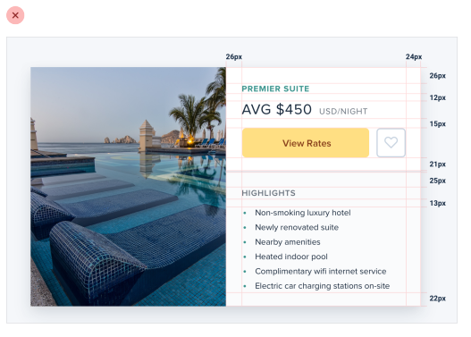

En su lugar, limítate a un conjunto restringido de valores, definido de antemano.

### Una escala lineal no funcionará

Crear un sistema de espaciado y tamaño no es tan simple como algo como "asegúrate de que todo sea un múltiplo de 4px" — un enfoque ingenuo como ese no hace más fácil elegir entre 120px y 125px.

Para que un sistema sea verdaderamente útil, necesita tomar en consideración la diferencia relativa entre valores adyacentes.

En el extremo pequeño de la escala (como el tamaño de un icono, o el padding dentro de un botón), un par de píxeles puede hacer una gran diferencia. ¡Saltar de 12px a 16px es un aumento del 33%! 

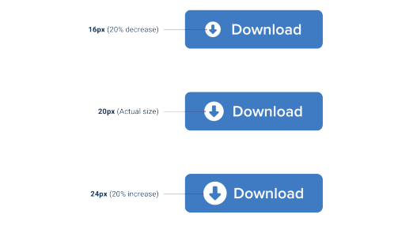

Pero en el extremo grande (el ancho de una tarjeta, o el espaciado vertical en el hero de una landing page), un par de píxeles es básicamente imperceptible. Incluso aumentar el ancho de una tarjeta de 500px a 520px es solo una diferencia del 4%, que es ocho veces menos significativa que el salto de 12px a 16px.

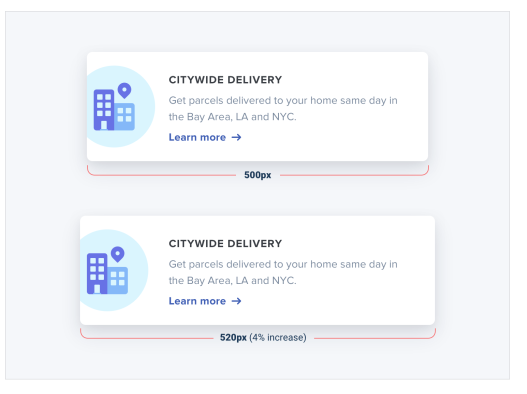

Si quieres que tu sistema facilite tomar decisiones de tamaño, asegúrate de que ningún par de valores en tu escala esté más cerca que alrededor del 25%.

### Definiendo el sistema

Justo como no quieres afanarte con valores arbitrarios al dimensionar un elemento o ajustar el espacio entre elementos, tampoco quieres construir tu escala de espaciado y tamaño a partir de valores arbitrarios.

Un enfoque simple es empezar con un valor base sensato, y luego construir una escala usando factores y múltiplos de ese valor.

16px es un gran número para empezar porque divide bien, y además resulta ser el tamaño de fuente por defecto en todos los navegadores web principales.

Los valores en el extremo pequeño de la escala deberían empezar bastante juntos, y hacerse progresivamente más separados a medida que subes en la escala.

Aquí hay un ejemplo de una escala bastante práctica construida usando este enfoque:

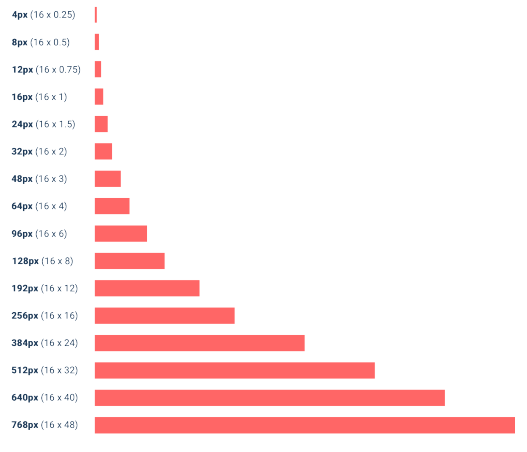

### Usando el sistema

Una vez que hayas definido tu sistema de espaciado y tamaño, te darás cuenta de que puedes diseñar mucho más rápido, especialmente si diseñas en el navegador (apegarse a un sistema es más fácil cuando escribes números que cuando arrastras con el mouse).

¿Necesitas añadir algo de espacio debajo de un elemento? Toma un valor de tu escala y pruébalo. ¿No es suficiente? El siguiente valor probablemente sea perfecto.

Mientras que las mejoras en el flujo de trabajo son probablemente el mayor beneficio, también empezarás a notar una consistencia sutil en tus diseños que no estaba ahí antes, y las cosas se verán solo un poco más limpias.

Un sistema de espaciado y tamaño te ayudará a crear mejores diseños, con menos esfuerzo, en menos tiempo.

## No tienes que llenar toda la pantalla

¿Recuerdas cuando 960px era el ancho de layout por defecto para los diseños de escritorio? Hoy en día te costaría encontrar un teléfono con una resolución tan baja.

Entonces no es sorpresa que cuando la mayoría de nosotros abre nuestra herramienta de diseño favorita en nuestros monitores de alta resolución, nos demos al menos 1200-1400px de espacio para llenar. Pero solo porque tengas el espacio, no significa que tengas que usarlo. 

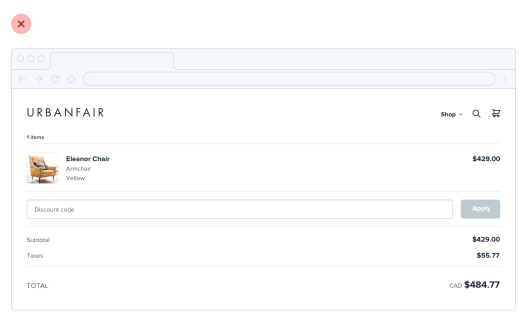

Si solo necesitas 600px, usa 600px. Esparcir las cosas o hacerlas innecesariamente anchas solo hace que una interfaz sea más difícil de interpretar, mientras que un poco de espacio extra alrededor de los bordes nunca le hizo daño a nadie.

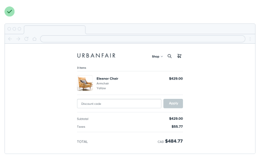

Esto también aplica a secciones individuales de una interfaz. No necesitas hacer todo a ancho completo solo porque algo más (como tu navegación) sea de ancho completo.

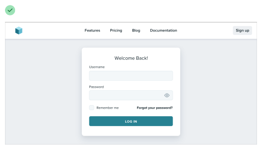

Dale a cada elemento solo el espacio que necesita — no empeores algo solo para que combine con otra cosa.

### Reduce el lienzo

Si tienes problemas para diseñar una interfaz pequeña en un lienzo grande, ¡reduce el lienzo! Muchas veces es más fácil diseñar algo pequeño cuando las restricciones son reales.

Si estás construyendo una aplicación web responsiva, intenta empezar con un lienzo de ~400px y diseñar primero el layout móvil. 

Una vez que tengas un diseño móvil con el que estés contento, llévalo a una pantalla de mayor tamaño y ajusta cualquier cosa que haya sentido como un compromiso en pantallas más pequeñas. Lo más probable es que no tengas que cambiar tanto como crees.

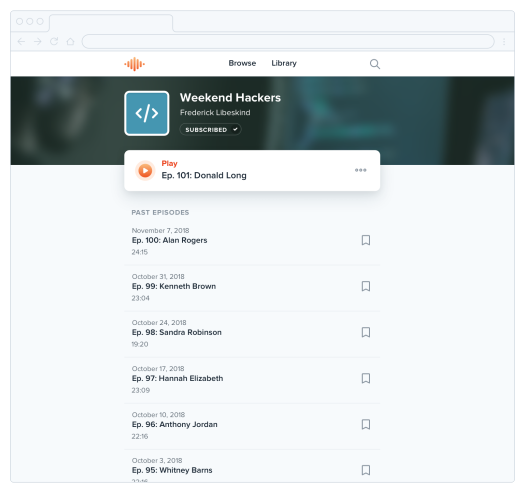

### Piensa en columnas

Si estás diseñando algo que funciona mejor a un ancho más estrecho pero se siente desequilibrado en el contexto de una UI por lo demás ancha, mira si puedes dividirlo en columnas en lugar de solo hacerlo más ancho.

Por ejemplo, toma este layout de formulario estrecho:

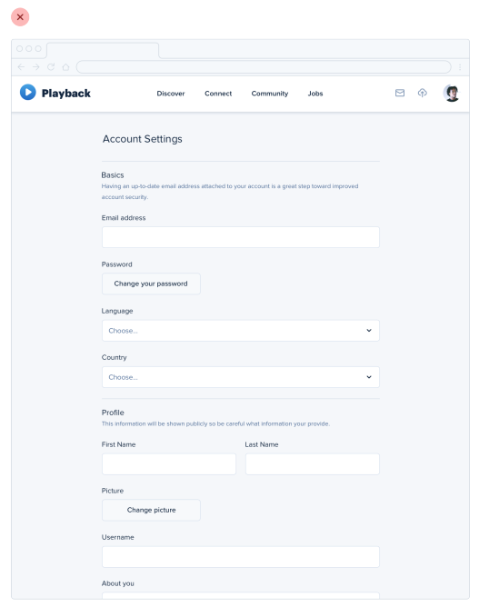

Si quisieras hacer mejor uso del espacio disponible sin hacer el formulario más difícil de usar, podrías separar el texto de apoyo en una columna aparte:

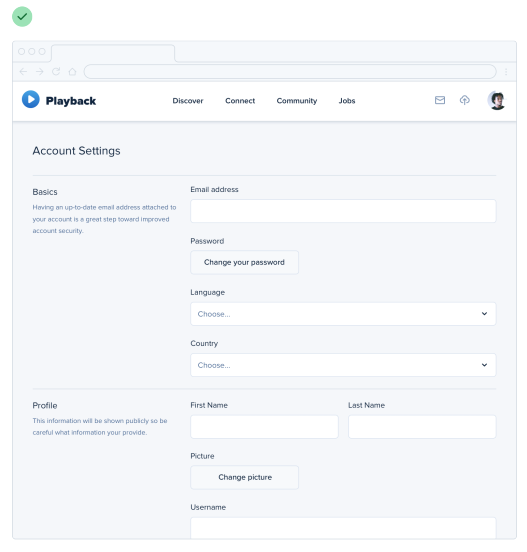

Esto hace que el diseño se sienta más equilibrado y consistente sin comprometer el ancho óptimo del formulario en sí.

### No lo fuerces

Justo como no deberías preocuparte por llenar toda la pantalla, tampoco deberías intentar meter todo en un área pequeña innecesariamente.

Si necesitas mucho espacio, ¡úsalo! Solo no te sientas obligado a llenarlo si no tienes que hacerlo.

## Los grids están sobrevalorados

Usar un sistema como un grid de 12 columnas es una gran manera de simplificar las decisiones de layout, y puede traer una satisfactoria sensación de orden a tus diseños. 

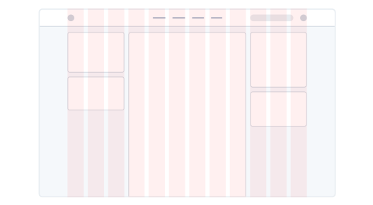

Pero aunque los grids pueden ser útiles, delegar todas tus decisiones de layout a un grid puede hacer más daño que bien.

### No todos los elementos deberían ser fluidos

Fundamentalmente, un sistema de grid se trata solo de darle a los elementos anchos fluidos basados en porcentajes, donde eliges de un conjunto restringido de porcentajes.

Por ejemplo, en un grid de 12 columnas cada columna es 8.33% de ancho. Mientras el ancho de un elemento sea algún múltiplo de 8.33% (incluyendo cualquier gutter), ese elemento está "en el grid".

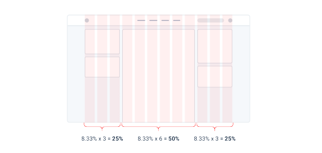

El problema con tratar los sistemas de grid como una religión es que hay muchas situaciones donde tiene mucho más sentido que un elemento tenga un ancho fijo en lugar de un ancho relativo.

Por ejemplo, considera un layout tradicional con barra lateral. Usando un sistema de grid de 12 columnas, podrías darle a la barra lateral un ancho de tres columnas (25%) y al área de contenido principal un ancho de nueve columnas (75%). 

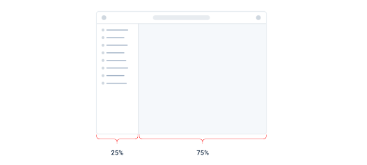

Esto puede parecer bien al principio, pero piensa en lo que pasa cuando redimensionas la pantalla.

Si haces la pantalla más ancha, la barra lateral también se hace más ancha, ocupando espacio que podría haberse aprovechado mejor con el área de contenido principal. 

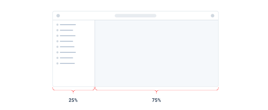

De manera similar, si haces la pantalla más estrecha, la barra lateral puede encogerse por debajo de su ancho mínimo razonable, causando ajustes de texto (wrapping) o truncamiento incómodos.

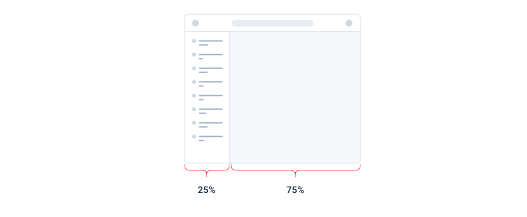

En esta situación, tiene mucho más sentido darle a la barra lateral un ancho fijo optimizado para su contenido. El área de contenido principal puede entonces flexionarse para llenar el espacio restante, usando su propio grid interno para acomodar a sus hijos.

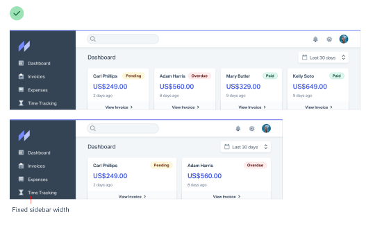

Esto aplica también dentro de los componentes — no uses porcentajes para dimensionar algo a menos que realmente quieras que escale.

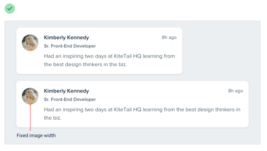

### No encojas un elemento hasta que lo necesites

Digamos que estás diseñando una tarjeta de inicio de sesión. Usar el ancho completo de la pantalla se vería feo, así que le das un ancho de 6 columnas (50%) con un offset de 3 columnas a cada lado. 

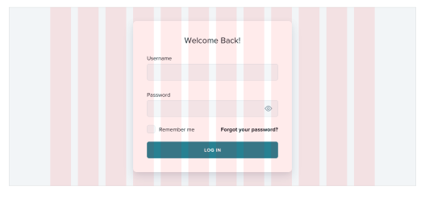

En pantallas medianas te das cuenta de que la tarjeta es un poco estrecha aunque tienes el espacio para hacerla más grande, así que en ese tamaño de pantalla la cambias a un ancho de 8 columnas, con dos columnas vacías a cada lado.

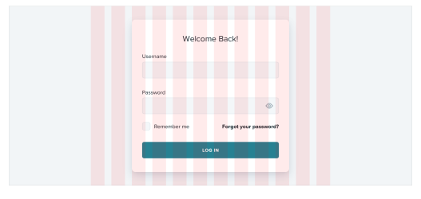

Lo tonto de este enfoque es que, como los anchos de columna son fluidos, hay un rango de tamaños de pantalla donde la tarjeta de inicio de sesión es más ancha en pantallas medianas que en pantallas grandes:

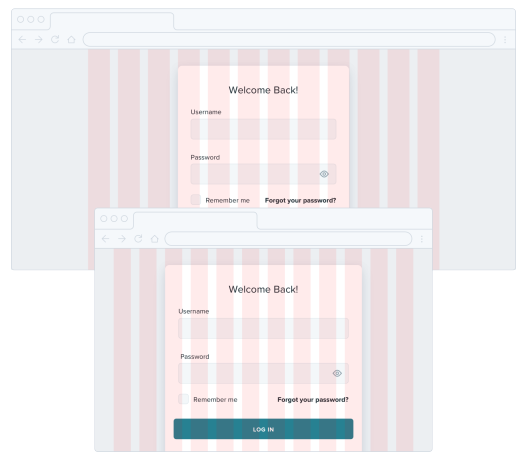

Si sabes que, digamos, 500px es el tamaño óptimo para la tarjeta, ¿por qué debería ser más pequeña que eso si tienes espacio para ella?

En lugar de dimensionar elementos así basándote en un grid, dales un ancho máximo (max-width) para que no se hagan demasiado grandes, y solo oblígalos a encogerse cuando la pantalla sea más pequeña que ese ancho máximo.

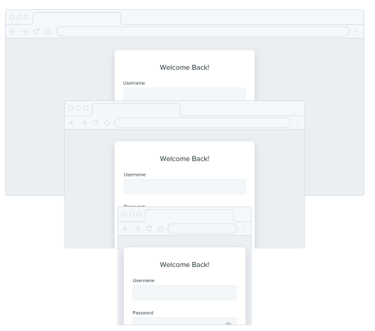

No seas esclavo del grid — dale a tus componentes el espacio que necesitan y no hagas compromisos hasta que sea realmente necesario.

## El dimensionamiento relativo no escala

Es tentador creer que cada parte de una interfaz debería dimensionarse relativa a las demás, y que si el elemento A necesita encogerse un 25% en pantallas más pequeñas, el elemento B también debería encogerse un 25%.

Por ejemplo, digamos que estás diseñando un artículo en un tamaño de pantalla grande. Si tu cuerpo de texto es 18px y tus titulares son 45px, es tentador codificar esa relación definiendo el tamaño de tus titulares como 2.5em; 2.5 veces el tamaño de fuente actual.

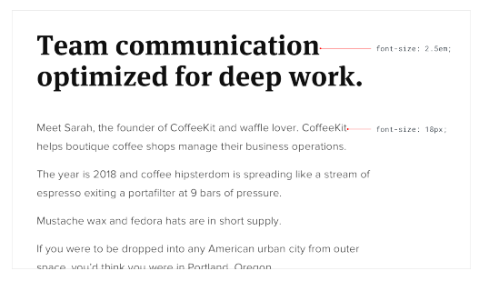

No hay nada intrínsecamente malo en usar unidades relativas como em, pero no te dejes engañar creyendo que las relaciones definidas de esta manera pueden permanecer estáticas — 2.5em puede ser el tamaño perfecto de titular en escritorio, pero no hay garantía de que sea el tamaño correcto en pantallas más pequeñas.

Digamos que reduces el tamaño de tu cuerpo de texto a 14px en pantallas pequeñas para mantener la longitud de línea bajo control. Mantener tus titulares a 2.5em significa un tamaño de fuente renderizado de 35px — ¡demasiado grande para una pantalla pequeña! 

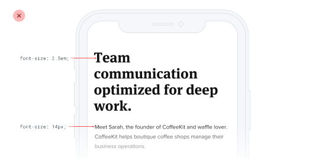

Un mejor tamaño de titular para pantallas pequeñas podría estar en algún lugar entre 20px y 24px:

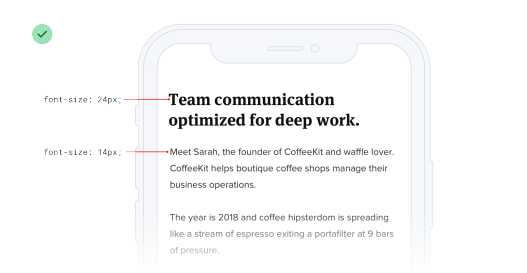

Eso es solo 1.5-1.7x el tamaño del cuerpo de texto de 14px — una relación totalmente diferente a la que tenía sentido en pantallas de escritorio. Eso significa que no hay ninguna relación real, y que no hay ningún beneficio real en tratar de definir el tamaño del titular relativo al tamaño del cuerpo de texto.

Como regla general, los elementos que son grandes en pantallas grandes necesitan encogerse más rápido que los elementos que ya son bastante pequeños — la diferencia entre elementos pequeños y grandes debería ser menos extrema en tamaños de pantalla pequeños.

### Relaciones dentro de los elementos

La idea de que las cosas deberían escalar de forma independiente no solo aplica a dimensionar elementos en diferentes tamaños de pantalla; también aplica a las propiedades de un solo componente.

Digamos que has diseñado un botón. Tiene un tamaño de fuente de 16px, 16px de padding horizontal, y 12px de padding vertical:

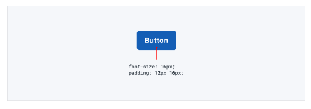

Muy parecido al ejemplo anterior, es tentador pensar que el padding debería definirse en términos del tamaño de fuente actual. De esa manera, si quieres un botón más grande o más pequeño, solo necesitas cambiar el tamaño de fuente y el padding se actualizará automáticamente, ¿verdad? 

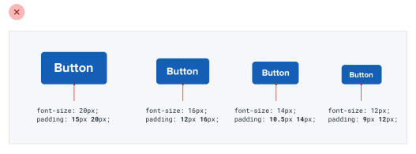

Esto funciona — los botones sí escalan hacia arriba o hacia abajo y preservan las mismas proporciones. ¿Pero es eso lo que realmente queremos?

Compara eso con estos botones, donde el padding se vuelve más generoso en tamaños más grandes y desproporcionadamente más ajustado en tamaños más pequeños:

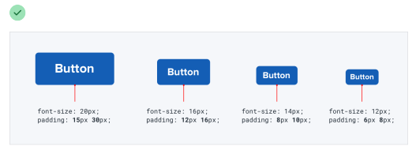

Aquí el botón grande realmente se siente como un botón más grande, y los botones pequeños realmente se sienten como botones más pequeños, no como si simplemente hubiéramos ajustado el zoom.

Deja ir la idea de que todo necesita escalar proporcionalmente — darte la libertad de ajustar las cosas de forma independiente hace mucho más fácil diseñar para múltiples contextos.

## Evita el espaciado ambiguo

Cuando grupos de elementos están explícitamente separados — generalmente por un borde o un color de fondo — es obvio qué elementos pertenecen a qué grupo. 

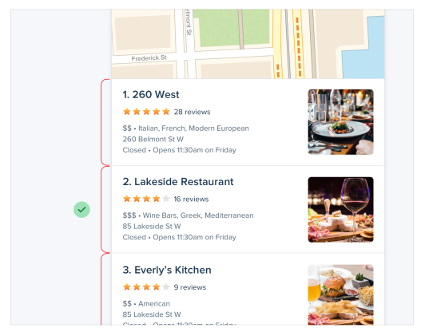

Pero cuando no hay un separador visible, no siempre es tan obvio.

Digamos que estás diseñando un formulario con etiquetas e inputs apilados. Si el margen debajo de la etiqueta es igual al margen debajo del input, los elementos en el grupo del formulario no se sentirán obviamente "conectados". 

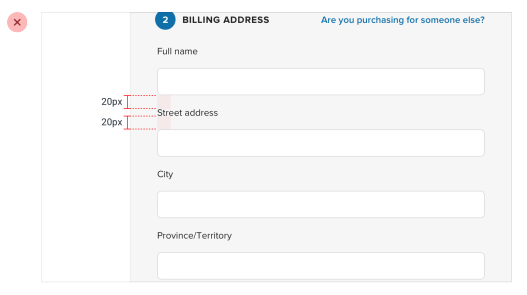

En el mejor de los casos el usuario tiene que trabajar más para interpretar la UI, y en el peor significa poner accidentalmente los datos equivocados en el campo equivocado.

La solución es aumentar el espacio entre cada grupo de formulario para que quede claro qué etiqueta pertenece a qué input:

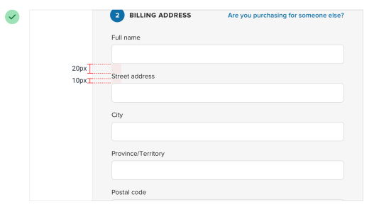

Este mismo problema aparece en el diseño de artículos cuando no hay suficiente espacio encima de los encabezados de sección:

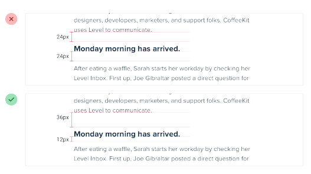

...y en listas con viñetas, cuando el espacio entre las viñetas coincide con la altura de línea de una sola viñeta:

Tampoco es solo el espaciado vertical lo que tienes que tener en cuenta; es fácil cometer este error con componentes que están dispuestos horizontalmente también:

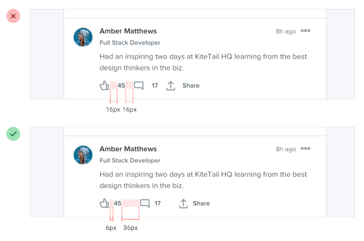

Cada vez que dependas del espaciado para conectar un grupo de elementos, asegúrate siempre de que haya más espacio alrededor del grupo del que hay dentro de él — las interfaces que son difíciles de entender siempre se ven peor.
