# Diseño de texto

## Establece una escala de tipografía

La mayoría de las interfaces usan demasiados tamaños de fuente. A menos que un equipo tenga un sistema de diseño rígido implementado, no es inusual encontrar que cada valor en píxeles de 10px a 24px se ha utilizado en la interfaz en algún lugar. 

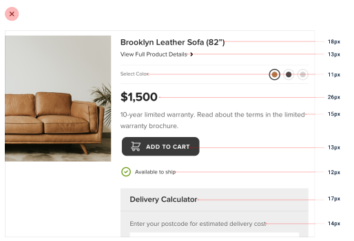

Elegir tamaños de fuente sin un sistema es una mala idea por dos razones:

1. Lleva a inconsistencias molestas en tus diseños.
2. Ralentiza tu flujo de trabajo.

Entonces, ¿cómo defines un sistema de tipografía?

### Elegir una escala

Al igual que con el espaciado y el dimensionado, una escala lineal no funcionará. Los saltos más pequeños entre tamaños de fuente son útiles en la parte inferior de la escala, pero no querrás perder tiempo decidiendo entre 46px y 48px para un titular grande.

#### Escalas modulares

Un enfoque es calcular tu escala de tipografía usando una proporción, como 4:5 (un "tercero mayor"), 2:3 (un "quinto perfecto"), o quizás la "proporción áurea", 1:1.618. Esto se llama a menudo una "escala modular".

Comienzas con un valor base razonable (16px es común ya que es el tamaño de fuente predeterminado para la mayoría de los navegadores), aplicas tu proporción para obtener el siguiente valor, luego aplicas tu proporción a ese valor para obtener el siguiente valor, y así sucesivamente:

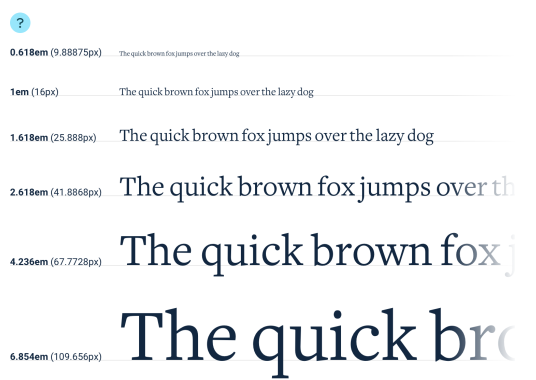

La pureza matemática de este enfoque es atractiva, pero en la práctica no es perfecto por un par de razones.

1. Terminas con valores fraccionarios.
Usando una base de 16px y una proporción de 4:5, tu escala terminará con muchos tamaños que no caen justo en el píxel, como 31.25px, 39.063px, 48.828px, etc. Los navegadores manejan el redondeo de subpíxeles todos un poco diferente, por lo que es mejor evitar tamaños fraccionarios si puedes.

Si quieres usar este enfoque, asegúrate de redondear los valores tú mismo al definir la escala para evitar problemas de un píxel de diferencia entre navegadores.

2. Generalmente necesitas más tamaños.
Este enfoque puede funcionar bien si estás definiendo una escala de tipografía para contenido de formato largo como un artículo, pero para el diseño de interfaz, los saltos que obtienes usando una escala modular suelen ser bastante limitantes.

Con una escala de tipografía (redondeada) de 3:4, obtienes tamaños como 12px, 16px, 21px y 28px. Aunque esto no parezca demasiado limitante en la superficie, en la práctica vas a desear tener un tamaño entre 12px y 16px, y otro entre 16px y 21px.

Podrías usar una proporción más ajustada como 8:9, pero en este punto solo estás tratando de elegir una escala que coincida con los tamaños que ya sabes que quieres.

#### Escalas hechas a mano

Para el diseño de interfaz, un enfoque más práctico es simplemente elegir valores a mano. No tienes que preocuparte por errores de redondeo de subpíxeles de esta manera, y tienes control total sobre qué tamaños existen en lugar de delegar ese trabajo a alguna fórmula matemática.

Aquí hay un ejemplo de una escala que funciona bien para la mayoría de los proyectos y se alinea bien con la escala de espaciado y dimensionado recomendada en "Establecer un sistema de espaciado y dimensionado":

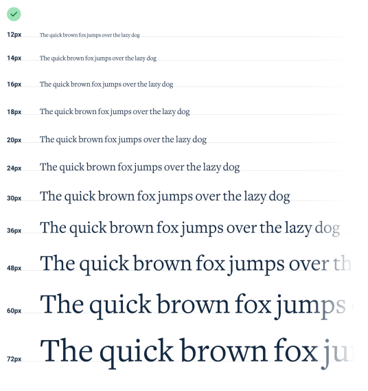

Está restringida lo suficiente para acelerar tu toma de decisiones, pero no tan limitada como para hacerte sentir que te falta un tamaño útil.

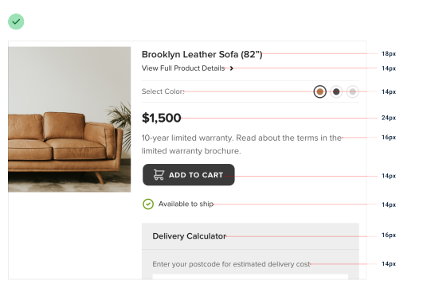

### Evita las unidades em

Cuando estás construyendo una escala de tipografía, no uses unidades em para definir tus tamaños. Debido a que las unidades em son relativas al tamaño de fuente actual, el tamaño de fuente calculado de los elementos anidados a menudo no es realmente un valor de tu escala.

Por ejemplo, digamos que has definido una escala de tipografía basada en em así:

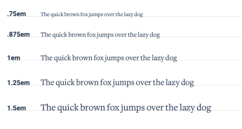

Si le das a un elemento un tamaño de fuente de 1.25em (20px por defecto), dentro de ese elemento 1em ahora es igual a 20px. Eso significa que si le das a uno de los elementos anidados un tamaño de fuente de .875em, el tamaño de fuente calculado real es 17.5px, ¡no un valor de tu escala!

Mantente en unidades px o rem — es la única forma de garantizar que realmente estás manteniendo el sistema.

## Usa buenas fuentes

Con miles de tipografías diferentes para elegir, separar las buenas de las malas puede ser una tarea intimidante.

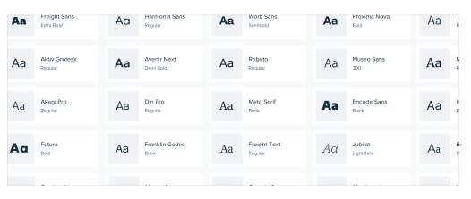

Desarrollar un ojo para todos los detalles que hacen buena a una tipografía puede llevar años. Probablemente no tengas años, así que aquí tienes algunos trucos que puedes usar para empezar a elegir tipografías de alta calidad de inmediato.

### Ve a lo seguro

Para el diseño de interfaz, tu apuesta más segura es una sans-serif bastante neutral —piensa en algo como Helvetica.

Si realmente no confías en tu propio gusto, una gran opción es confiar en la pila de fuentes del sistema:

`-apple-system, Segoe UI, Roboto, Noto Sans, Ubuntu, Cantarell, Helvetica Neue`;

Puede que no sea la elección más ambiciosa, pero al menos tus usuarios ya estarán acostumbrados a verla.

### Ignora las tipografías con menos de cinco pesos

Esto no siempre es cierto, pero como regla general, las tipografías que vienen en muchos pesos diferentes tienden a estar elaboradas con más cuidado y atención al detalle que las tipografías con menos pesos.

Muchos directorios de fuentes (como Google Fonts) te permiten filtrar por "número de estilos", que es una combinación de los pesos disponibles así como de las variaciones en cursiva de esos pesos.

Una gran manera de limitar el número de opciones entre las que tienes que elegir es subir eso a 10+ (para tener en cuenta las cursivas):

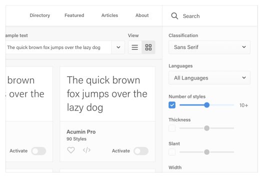

En Google Fonts específicamente, eso elimina el 85% de las opciones disponibles, dejándote con menos de 50 sans-serifs para elegir.

### Optimiza para la legibilidad

Cuando alguien diseña una familia tipográfica, generalmente la diseña para un propósito específico. Las fuentes pensadas para titulares suelen tener un interletrado más ajustado y letras minúsculas más cortas (una altura de x menor), mientras que las fuentes pensadas para tamaños pequeños tienen un interletrado más amplio y letras minúsculas más altas.

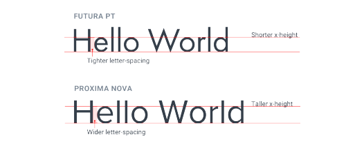

Ten esto en cuenta y evita usar tipografías condensadas con alturas de x cortas para tu texto principal de interfaz.

### Confía en la sabiduría de la multitud

Si una fuente es popular, probablemente es una buena fuente. La mayoría de los directorios de fuentes te permiten ordenar por popularidad, así que esta puede ser una gran manera de limitar tus opciones.

Esto es especialmente útil cuando intentas elegir algo que no sea una tipografía de interfaz neutral. Elegir una serif bonita con algo de personalidad, por ejemplo, puede ser difícil.

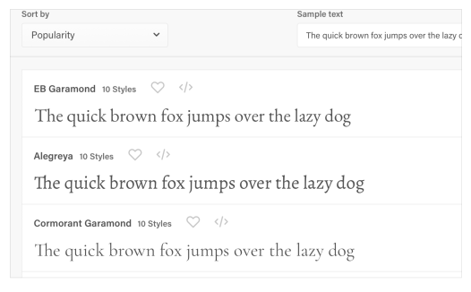

Aprovechar el poder de decisión colectivo de miles de otras personas puede hacerlo mucho más fácil.

### Roba de la gente a la que le importa

Inspecciona algunos de tus sitios favoritos y mira qué tipografías están usando.

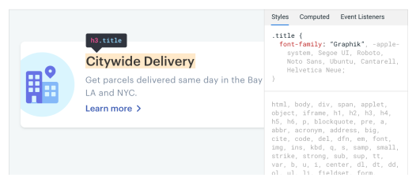

Hay un montón de grandes equipos de diseño llenos de personas con opiniones muy fuertes sobre la tipografía, y a menudo elegirán fuentes geniales que quizás nunca habrías encontrado usando algunos de los enfoques más seguros descritos anteriormente.

### Desarrolla tu intuición

Una vez que empiezas a prestar más atención a la tipografía en sitios bien diseñados, no pasa mucho tiempo antes de que te sientas bastante cómodo etiquetando una tipografía como increíble o terrible.

Pronto te convertirás en un esnob de la tipografía, pero los consejos descritos anteriormente te ayudarán a sobrevivir mientras tanto.

## Mantén tu longitud de línea bajo control

Al dar estilo a los párrafos, es fácil cometer el error de ajustar el texto a tu diseño en lugar de intentar crear la mejor experiencia de lectura.

Normalmente esto significa líneas demasiado largas, lo que hace que el texto sea más difícil de leer. 

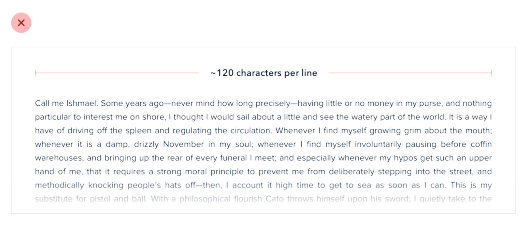

Para la mejor experiencia de lectura, haz que tus párrafos sean lo suficientemente anchos como para albergar entre 45 y 75 caracteres por línea. La forma más fácil de hacer esto en la web es usando unidades em, que son relativas al tamaño de fuente actual. Un ancho de 20-35em te pondrá en el terreno correcto.

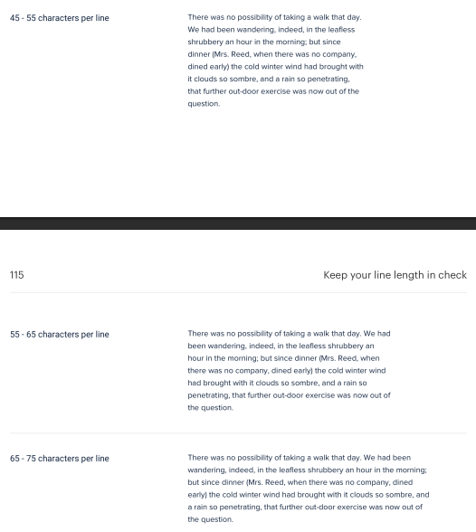

Ir un poco más ancho de 75 caracteres por línea a veces también puede funcionar, pero ten en cuenta que estás entrando en territorio de riesgo — mantente en el rango de 45-75 si quieres ir a lo seguro.

### Cómo lidiar con contenido más ancho

Si estás mezclando texto de párrafo con imágenes u otros componentes grandes, igual deberías limitar el ancho del párrafo incluso si el área de contenido general necesita ser más ancha para acomodar los otros elementos.

Puede parecer contraintuitivo al principio usar diferentes anchos en la misma área de contenido, pero el resultado casi siempre se ve más pulido.

## Línea base, no centrado

Hay muchas situaciones en las que tiene sentido usar múltiples tamaños de fuente para crear jerarquía en una sola línea.

Por ejemplo, quizás estás diseñando una tarjeta que tiene un título grande en la parte superior izquierda y una lista más pequeña de acciones en la parte superior derecha.

Cuando mezclas tamaños de fuente de esta manera, tu instinto podría ser centrar verticalmente el texto para lograr equilibrio:

Cuando hay una cantidad decente de espacio entre los diferentes tamaños de fuente, a menudo no se verá lo suficientemente malo como para llamar tu atención, pero cuando el texto está muy junto, la alineación incómoda se hace más evidente:

Un mejor enfoque es alinear los tamaños de fuente mezclados por su línea base, que es la línea imaginaria sobre la que descansan las letras:

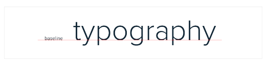

Cuando alineas tamaños de fuente mezclados por su línea base, estás aprovechando una referencia de alineación que tus ojos ya perciben.

El resultado es una apariencia más simple y limpia que la que obtienes cuando centras dos piezas de texto y desplazas sus líneas base.

## El interlineado es proporcional

Quizás hayas escuchado el consejo de que un interlineado de alrededor de 1.5 es un buen punto de partida desde una perspectiva de legibilidad. 

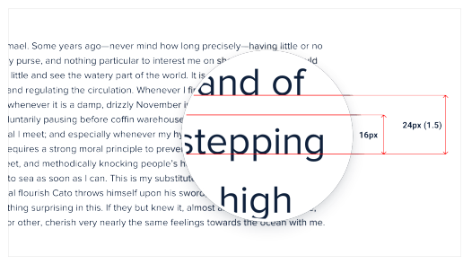

Aunque eso no es necesariamente falso, elegir el interlineado correcto para tu texto es un poco más complicado que simplemente usar el mismo valor en todas las situaciones.

### Teniendo en cuenta la longitud de línea

La razón por la que agregamos espacio entre líneas de texto es para que sea fácil para el lector encontrar la siguiente línea cuando el texto hace el salto de línea. ¿Alguna vez has leído accidentalmente la misma línea de texto dos veces, o saltado una línea sin querer? El interlineado probablemente era demasiado corto.

Cuando las líneas de texto están espaciadas demasiado juntas, es fácil terminar de leer una línea de texto en el borde derecho de una página y luego saltar tus ojos de vuelta al borde izquierdo solo para no estar seguro de cuál es la siguiente línea. 

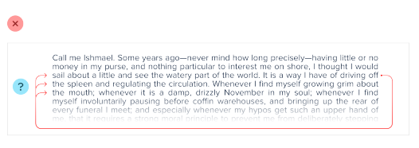

Este problema se magnifica cuando las líneas de texto son largas. Cuanto más lejos tengan que saltar tus ojos horizontalmente para leer la siguiente línea, más fácil es perder el lugar.

Eso significa que tu interlineado y el ancho del párrafo deberían ser proporcionales — el contenido estrecho puede usar un interlineado más corto como 1.5, pero el contenido ancho podría necesitar un interlineado tan alto como 2.

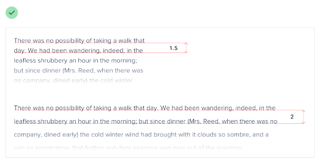

### Teniendo en cuenta el tamaño de fuente

La longitud de línea no es el único factor para elegir el interlineado correcto — el tamaño de fuente también tiene un gran impacto.

Cuando el texto es pequeño, el espacio extra entre líneas es importante porque hace mucho más fácil para tus ojos encontrar la siguiente línea cuando el texto hace el salto de línea. 

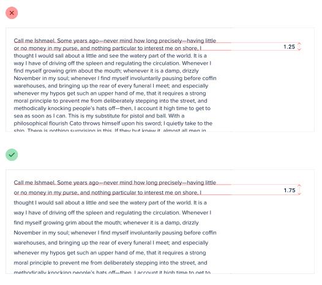

Pero a medida que el texto se hace más grande, tus ojos no necesitan tanta ayuda. Esto significa que para textos de titulares grandes quizás no necesites espacio extra entre líneas, y un interlineado de 1 está perfectamente bien.

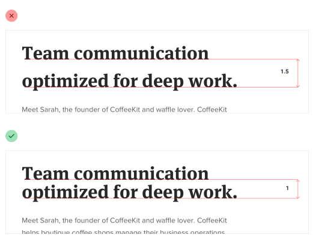

El interlineado y el tamaño de fuente son inversamente proporcionales — usa un interlineado más alto para texto pequeño y un interlineado más corto para texto grande.

## No todos los enlaces necesitan un color

Cuando estás incluyendo un enlace en un bloque de texto que de otro modo no es un enlace, es importante asegurarte de que el enlace se destaque y parezca que se puede hacer clic. 

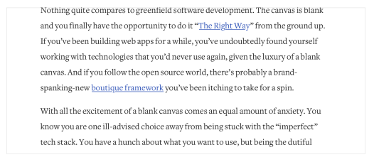

Pero cuando estás diseñando una interfaz donde casi todo es un enlace, usar un tratamiento diseñado para hacer que los enlaces "resalten" en texto de párrafo puede ser realmente abrumador.

En su lugar, enfatiza la mayoría de los enlaces de una manera más sutil, como usando solo un peso de fuente más grueso o un color más oscuro.

Algunos enlaces quizás ni siquiera necesiten enfatizarse por defecto. Si tienes enlaces en tu interfaz que son realmente secundarios y no forman parte del camino principal que un usuario recorre a través de la aplicación, considera añadir un subrayado o cambiar el color solo al pasar el cursor por encima.

Aún serán descubribles para cualquier usuario que piense en intentarlo, pero no competirán por la atención con las acciones más importantes de la página.

## Alinea con la legibilidad en mente

En general, el texto debería alinearse para coincidir con la dirección del idioma en el que está escrito. Para el inglés (y la mayoría de otros idiomas), eso significa que la gran mayoría del texto debería estar alineado a la izquierda. 

Las otras opciones de alineación tienen su lugar, solo necesitas usarlas de manera efectiva.

### No centres texto de formato largo

La alineación centrada puede verse genial para titulares o bloques cortos e independientes de texto.

Pero si algo es más largo de dos o tres líneas, casi siempre se verá mejor alineado a la izquierda.

Si tienes algunos bloques de texto que quieres centrar pero uno de ellos es un poco demasiado largo, la solución más fácil es reescribir el contenido y hacerlo más corto:

No solo solucionará el problema de alineación, también hará que tu diseño se sienta más consistente.

### Alinea los números a la derecha

Si estás diseñando una tabla que incluye números, alinéalos a la derecha. 

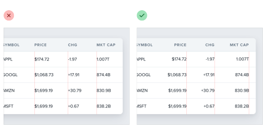

Cuando el decimal en una lista de números está siempre en el mismo lugar, son mucho más fáciles de comparar de un vistazo.

### Aplica guiones al texto justificado

El texto justificado se ve genial en impresión y puede funcionar bien en la web cuando buscas una apariencia más formal, pero sin cuidado especial, puede crear muchos espacios incómodos entre palabras:

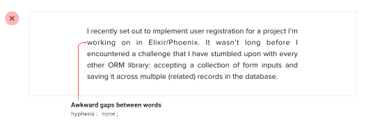

Para evitar esto, cuando justifiques texto, también deberías habilitar la separación silábica (guionado):

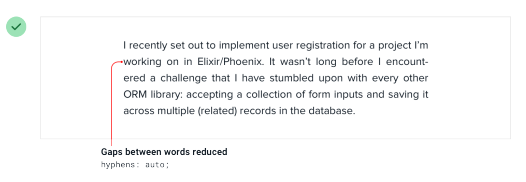

El texto justificado funciona mejor en situaciones donde intentas imitar una apariencia de impresión, quizás para una revista o periódico en línea. Aun así, el texto alineado a la izquierda también funciona muy bien, así que realmente es solo una cuestión de preferencia.

## Usa el interletrado de manera efectiva

Al dar estilo al texto, se pone mucho esfuerzo en conseguir que el peso, el color y el interlineado estén bien, pero es fácil olvidar que el interletrado también puede ajustarse. 

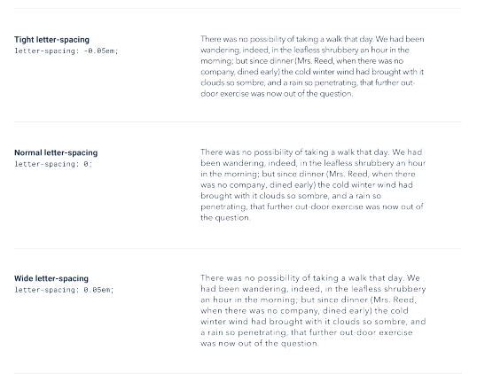

Como regla general, deberías confiar en el diseñador de la tipografía y no tocar el interletrado. Dicho esto, hay un par de situaciones comunes donde ajustarlo puede mejorar tus diseños.

### Ajustando los titulares

Cuando alguien diseña una familia tipográfica, la diseña con un propósito en mente. 

Una familia como Open Sans está diseñada para ser altamente legible incluso en tamaños pequeños, por lo que su interletrado incorporado es mucho más amplio que el de una familia como Oswald, que está diseñada para titulares.

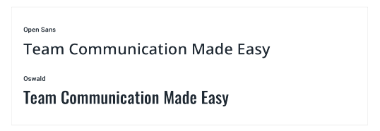

Si quieres usar una familia con interletrado más amplio para titulares o títulos, a menudo tiene sentido disminuir el interletrado para imitar la apariencia condensada de una familia de titulares hecha a propósito:

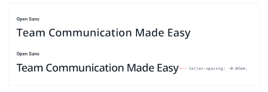

Evita intentar hacer que esto funcione al revés — las fuentes de titulares rara vez funcionan bien en tamaños pequeños incluso si aumentas el interletrado.

### Mejorando la legibilidad de las mayúsculas sostenidas

El interletrado en la mayoría de las familias tipográficas está optimizado para texto normal en "caso de oración" — una letra mayúscula seguida de letras mayormente minúsculas.

Las letras minúsculas tienen mucha variedad visual. Letras como n, v y e encajan completamente dentro de la altura de x de una tipografía, otras letras como y, g y p tienen descendentes que sobresalen por debajo de la línea base, y letras como b, f y t tienen ascendentes que se extienden hacia arriba.

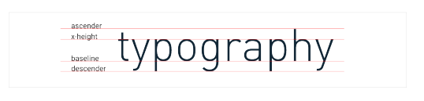

El texto en mayúsculas sostenidas, por otro lado, no es tan diverso. Dado que cada letra tiene la misma altura, usar el interletrado predeterminado a menudo lleva a un texto que es más difícil de leer porque hay menos características distintivas entre las letras.

Por esa razón, a menudo tiene sentido aumentar el interletrado del texto en mayúsculas sostenidas para mejorar la legibilidad:

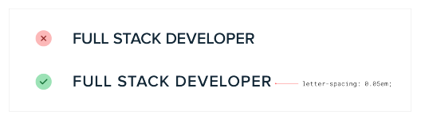

