# Trabajando con color

## Deja el hex por el HSL

El hex y el RGB son los formatos más comunes para representar el color en la web, pero no son los más útiles.

Usando hex o RGB, los colores que tienen mucho en común visualmente no se parecen en nada en el código.

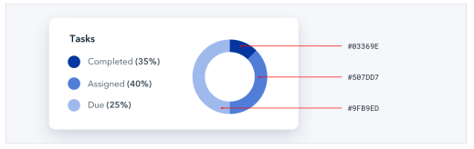

El HSL soluciona esto representando los colores usando atributos que el ojo humano percibe intuitivamente: tono (hue), saturación y luminosidad.

El tono (Hue) es la posición de un color en la rueda de colores — es el atributo de un color que nos permite identificar dos colores como "azul" aunque no sean idénticos.

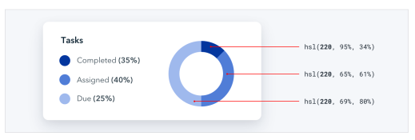

El tono se mide en grados, donde 0° es rojo, 120° es verde y 240° es azul.

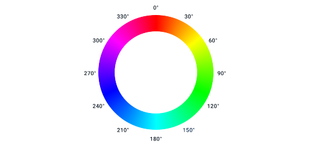

La saturación es qué tan colorido o vívido se ve un color. 0% de saturación es gris (sin color), y 100% de saturación es vibrante e intenso.

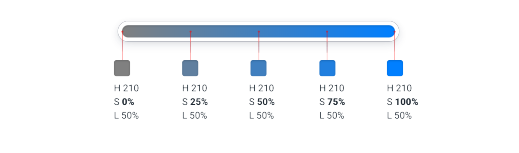

Sin saturación, el tono es irrelevante — rotar el tono cuando la saturación es 0% no cambia el color en absoluto.

La luminosidad es exactamente lo que suena — mide qué tan cerca está un color del negro o del blanco. 0% de luminosidad es negro puro, 100% de luminosidad es blanco puro, y 50% de luminosidad es un color puro en el tono dado.

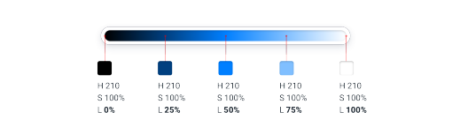

### HSL vs. HSB

No confundas HSL con HSB — la luminosidad en HSL no es lo mismo que el brillo en HSB.

En HSB, 0% de brillo siempre es negro, pero 100% de brillo solo es blanco cuando la saturación es 0%. Cuando la saturación es 100%, 100% de brillo en HSB es lo mismo que 100% de saturación y 50% de luminosidad en HSL.

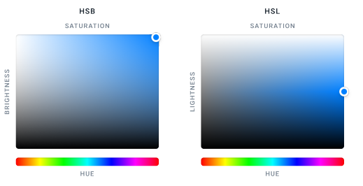

El HSB es más común que el HSL en el software de diseño, pero los navegadores solo entienden HSL, así que si estás diseñando para la web, el HSL debería ser tu arma de elección.

## Necesitas más colores de los que crees

¿Alguna vez has usado uno de esos generadores de paletas de colores donde eliges un color inicial, ajustas algunas opciones, y luego recibes los cinco colores perfectos que deberías usar para construir tu sitio web? 

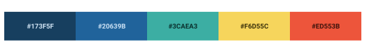

Este enfoque calculado para elegir el esquema de color perfecto es extremadamente seductor, pero no es muy útil a menos que quieras que tu sitio se vea así:

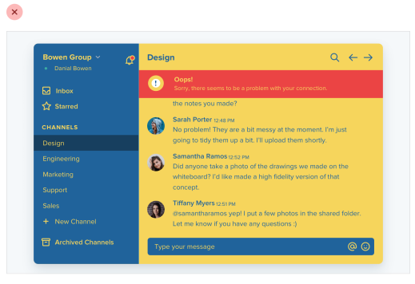

### Lo que realmente necesitas

No puedes construir nada con cinco códigos hex. Para construir algo real, necesitas un conjunto mucho más completo de colores para elegir.

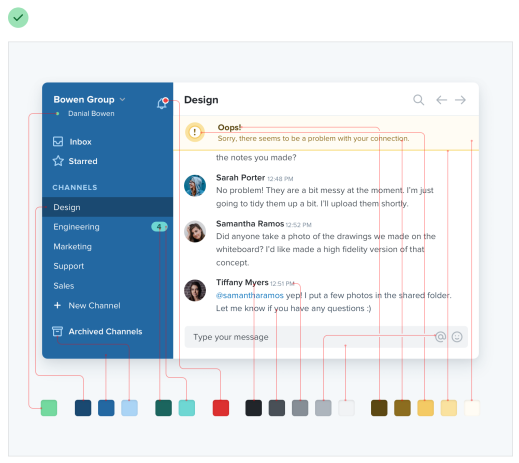

Puedes dividir una buena paleta de colores en tres categorías.

### Grises

Texto, fondos, paneles, controles de formulario — casi todo en una interfaz es gris.

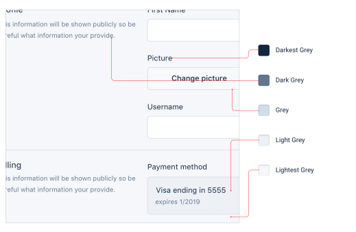

Necesitarás más grises de los que crees, también — tres o cuatro tonos pueden sonar suficientes pero no pasará mucho tiempo antes de que desees tener algo un poco más oscuro que el tono #2 pero un poco más claro que el tono #3.

En la práctica, quieres 8-10 tonos para elegir (más sobre esto en "Define tus tonos por adelantado"). No tantos que pierdas tiempo decidiendo entre el tono #77 y el tono #78, pero suficientes para asegurarte de no tener que comprometerte demasiado.

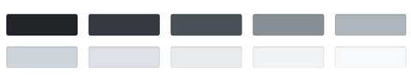

El negro puro tiende a verse bastante poco natural, así que comienza con un gris realmente oscuro y avanza hasta el blanco en incrementos constantes.

### Color(es) primario(s)

La mayoría de los sitios necesitan uno, quizás dos colores que se usen para las acciones primarias, elementos de navegación activos, etc. Estos son los colores que determinan el aspecto general de un sitio — los que te hacen pensar en Facebook como "azul".

Al igual que con los grises, necesitas una variedad (5-10) de tonos más claros y más oscuros para elegir. 

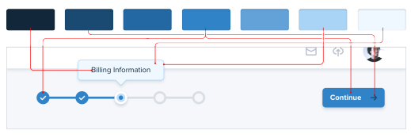

Los tonos ultra claros pueden ser útiles como fondo teñido para cosas como alertas, mientras que los tonos más oscuros funcionan muy bien para el texto.

### Colores de acento

Además de los colores primarios, cada sitio necesita algunos colores de acento para comunicar diferentes cosas al usuario.

Por ejemplo, quizás quieras usar un color llamativo como amarillo, rosa o verde azulado para resaltar una nueva función:

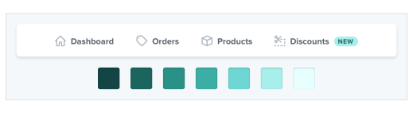

También podrías necesitar colores para enfatizar diferentes estados semánticos, como rojo para confirmar una acción destructiva:

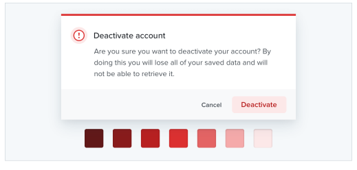

…amarillo para un mensaje de advertencia:

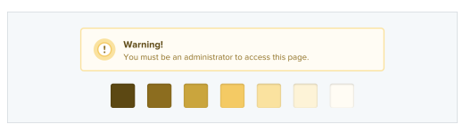

…o verde para resaltar una tendencia positiva:

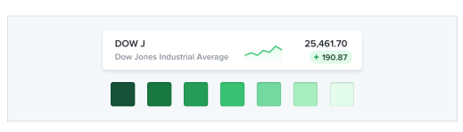

Querrás múltiples tonos para estos colores también, aunque deberían usarse con bastante moderación en toda la interfaz.

Si estás construyendo algo donde necesitas usar color para distinguir o categorizar elementos similares (como líneas en gráficos, eventos en un calendario, o etiquetas en un proyecto), podrías necesitar incluso más colores de acento.

En total, no es inusual necesitar hasta diez colores diferentes con 5-10 tonos cada uno para una interfaz compleja.

## Define tus tonos por adelantado

Cuando necesites crear una variación más clara o más oscura de un color en tu paleta, no te pongas ingenioso usando funciones de procesadores CSS como "lighten" o "darken" para crear tonos sobre la marcha. Así es como terminas con 35 azules ligeramente diferentes que todos se ven iguales.

En su lugar, define un conjunto fijo de tonos por adelantado entre los que puedas elegir mientras trabajas. 

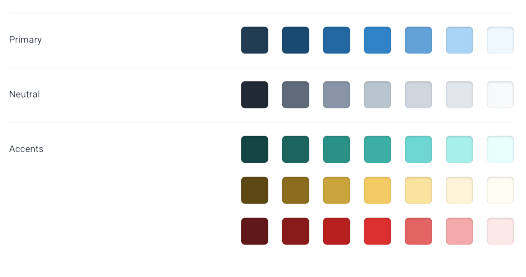

Entonces, ¿cómo armas una paleta como esta de todos modos?

### Elige el color base primero

Empieza eligiendo un color base para la escala que quieres crear — el color en el medio en el que se basan tus tonos más claros y más oscuros.

No hay una forma realmente científica de hacer esto, pero para los colores primarios y de acento, una buena regla general es elegir un tono que funcione bien como fondo de un botón. 

Es importante notar que no hay reglas reales aquí como "empieza en 50% de luminosidad" ni nada — cada color se comporta un poco diferente, así que tendrás que confiar en tus ojos para esto.

### Encontrando los extremos

A continuación, elige tu tono más oscuro y tu tono más claro. Tampoco hay una ciencia real en esto, pero ayuda pensar en dónde se usarán y elegirlos usando ese contexto.

El tono más oscuro de un color suele reservarse para el texto, mientras que el tono más claro podría usarse para teñir el fondo de un elemento.

Un componente de alerta simple es un buen ejemplo que combina ambos casos de uso, así que puede ser un gran lugar para elegir estos colores. 

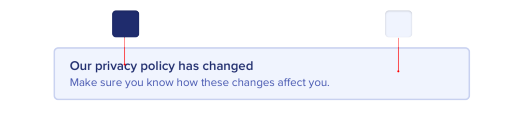

Empieza con un color que coincida con el tono de tu color base, y ajusta la saturación y la luminosidad hasta que estés satisfecho.

### Llenando los huecos

Una vez que tienes tus tonos base, más oscuro y más claro, solo necesitas llenar los huecos entre ellos.

Para la mayoría de los proyectos, necesitarás al menos 5 tonos por color, y probablemente cerca de 10 si no quieres sentirte demasiado limitado.

Nueve es un gran número porque es fácil de dividir y hace que llenar los huecos sea un poco más directo. Llamemos a nuestro tono más oscuro 900, a nuestro tono base 500, y a nuestro tono más claro 100. 

Empieza eligiendo los tonos 700 y 300, los que están justo en el medio de los huecos. Quieres que estos tonos se sientan como el compromiso perfecto entre los tonos de cada lado.

Esto crea cuatro huecos más en la escala (800, 600, 400 y 200), que puedes llenar usando el mismo enfoque.

Deberías terminar con un conjunto bastante equilibrado de colores que proporcionen justo suficientes opciones para acomodar tus ideas de diseño sin sentirse limitante.

### ¿Y los grises?

Con los grises el color base no es tan importante, pero por lo demás el proceso es el mismo. Empieza en los extremos y llena los huecos hasta que tengas lo que necesitas. 

Elige tu gris más oscuro seleccionando un color para el texto más oscuro de tu proyecto, y tu gris más claro eligiendo algo que funcione bien como un fondo blanquecino sutil.

### No es una ciencia

Por tentador que sea, no puedes confiar puramente en las matemáticas para crear la paleta de colores perfecta.

Un enfoque sistemático como el descrito arriba es genial para empezar, pero no tengas miedo de hacer pequeños ajustes si lo necesitas.

Una vez que realmente empiezas a usar tus colores en tus diseños, es casi inevitable que quieras ajustar la saturación de un tono, o hacer un par de tonos más claros o más oscuros. Confía en tus ojos, no en los números.

Solo trata de evitar añadir nuevos tonos demasiado a menudo si puedes. Si no eres diligente en limitar tu paleta, podría ser como no tener ningún sistema de color en absoluto.

## No dejes que la luminosidad mate tu saturación

En el espacio de color HSL, a medida que un color se acerca a 0% o 100% de luminosidad, el impacto de la saturación se debilita — el mismo valor de saturación al 50% de luminosidad se ve más colorido que al 90% de luminosidad.

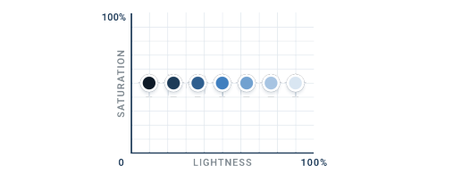

Eso significa que si no quieres que los tonos más claros y más oscuros de un color dado se vean deslavados, necesitas aumentar la saturación a medida que la luminosidad se aleja de 50%.

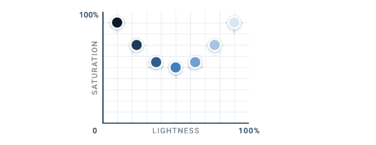

Es sutil pero los pequeños detalles como este se acumulan, especialmente cuando un color se aplica a una gran sección de una interfaz.

Pero ¿qué pasa si tu color base ya está muy saturado? ¿Cómo aumentas la saturación si ya está al 100%?

### Usa el brillo percibido a tu favor

¿Cuál de estos dos colores crees que es más claro? 

El amarillo, ¿verdad? Bueno, resulta que ambos colores tienen realmente la misma "luminosidad" en términos de HSL:

Entonces, ¿por qué vemos el amarillo como más claro? Bueno, resulta que cada tono tiene un brillo percibido inherente debido a cómo el ojo humano percibe el color.

Puedes calcular el brillo percibido de un color insertando sus componentes RGB en esta fórmula:

Tomando muestras de diferentes tonos con 100% de saturación y 50% de luminosidad, podemos tener una buena idea del brillo percibido de diferentes colores alrededor de la rueda de colores:

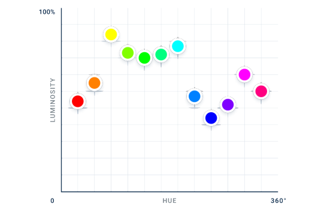

Como se esperaba, el amarillo tiene un brillo percibido más alto que el azul. Pero lo interesante aquí es que el brillo percibido no cambia simplemente de forma lineal desde el tono más oscuro hasta el tono más claro — en su lugar, hay tres mínimos locales separados (rojo, verde y azul) y tres máximos locales (amarillo, cian y magenta).

### Cambiando el brillo rotando el tono

En la superficie, esto es ciertamente una cosa interesante de entender sobre el color. Pero las cosas se ponen realmente interesantes cuando te das cuenta de cómo puedes usar este conocimiento en tus diseños.

Normalmente cuando quieres cambiar qué tan claro se ve un color, ajustas el componente de luminosidad:

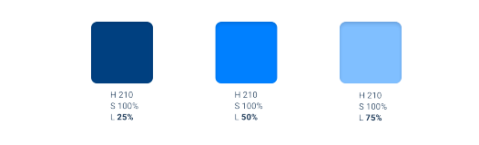

Aunque esto funciona para aclarar u oscurecer un color, a menudo pierdes algo de la intensidad del color — el color también se ve más cerca del blanco o del negro, no solo más claro o más oscuro.

Dado que diferentes tonos tienen un brillo percibido diferente, otra forma en la que puedes cambiar el brillo de un color es rotando su tono.

Para hacer un color más claro, rota el tono hacia el tono brillante más cercano — 60°, 180° o 300°.

Para hacer un color más oscuro, rota el tono hacia el tono oscuro más cercano — 0°, 120° o 240°.

Esto puede ser realmente útil al intentar crear una paleta para un color claro como el amarillo. Al rotar gradualmente el tono hacia más un naranja mientras disminuyes la luminosidad, los tonos más oscuros se sentirán cálidos y ricos en lugar de apagados y marrones:

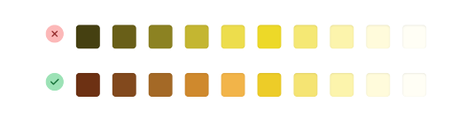

Por supuesto también puedes combinar estos enfoques, obteniendo algo del brillo ajustando el tono y algo ajustando la luminosidad.

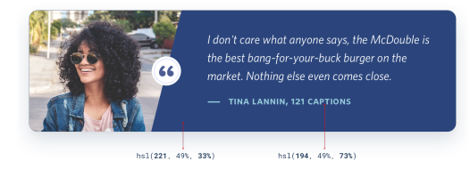

Aunque es una gran manera de cambiar el brillo de un color sin afectar su intensidad, funciona mejor en dosis pequeñas. No rotees el tono más de 20-30° o se verá como un color completamente diferente en lugar de solo más claro o más oscuro.

