# Creando profundidad

## Emula una fuente de luz

¿Alguna vez has notado cómo algunos elementos en una interfaz se sienten como si estuvieran elevados de la página, mientras que otros se sienten como si estuvieran hundidos en el fondo?

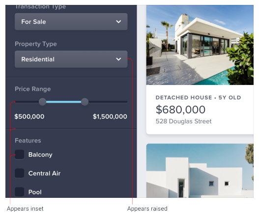

Crear este efecto puede parecer complicado al principio, pero en realidad solo requiere que entiendas una regla fundamental.

### La luz viene de arriba

Echa un vistazo a los paneles de esta puerta:

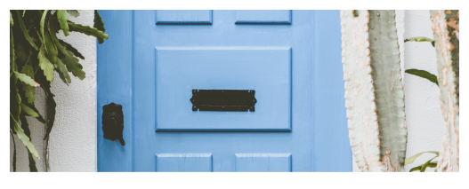

Aunque solo estés mirando una imagen plana, sigue siendo bastante obvio que los paneles de la puerta están elevados. ¿Por qué es eso?

Nota cómo el borde superior del panel es más claro. Eso es porque está inclinado hacia el cielo y recibe más luz. De manera similar, el borde inferior es más oscuro porque está inclinado en dirección opuesta al cielo, recibiendo menos luz.

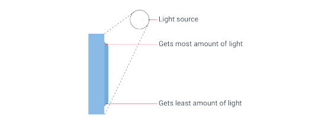

La única forma en que esos bordes podrían estar orientados de esa manera es si el panel en sí está elevado, así que así es como lo perciben nuestros cerebros.

Ahora echa un vistazo a los paneles de este gabinete:

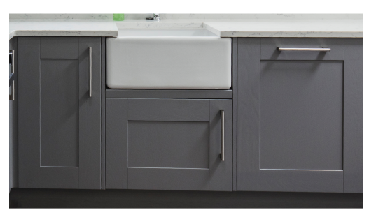

En este caso está claro que los paneles están hundidos porque hay una sombra en la parte superior que indica que el borde de arriba está bloqueando la luz, y el borde inferior es más claro, indicando que está inclinado hacia arriba.

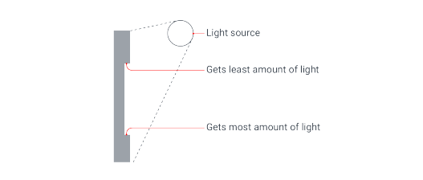

Para crear este mismo sentido de profundidad en tus diseños, todo lo que necesitas hacer es imitar la forma en que la luz afecta a las cosas en el mundo real.

### Simulando la luz en una interfaz de usuario

Si quieres que un elemento se vea elevado o hundido, primero averigua qué perfil quieres que tenga ese elemento, y luego imita cómo interactuaría una fuente de luz con esa forma.

#### Elementos elevados

Por ejemplo, digamos que tienes un botón y quieres que se sienta elevado de la página, con bordes perfectamente planos en la parte superior e inferior:

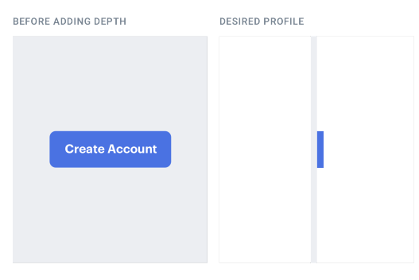

Debido a que los bordes superior e inferior son ambos planos, sería imposible ver ambos al mismo tiempo. Las personas generalmente miran ligeramente hacia abajo a sus pantallas, así que para el aspecto más natural, revela un poco del borde superior y oculta el borde inferior.

Ya que el borde superior mira hacia arriba, hazlo ligeramente más claro que la cara del botón, usualmente usando un borde superior o una sombra interior (inset box shadow) con un ligero desplazamiento vertical:

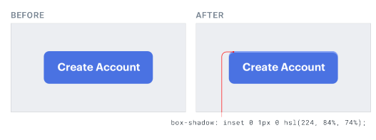

Elige el color más claro a mano en lugar de usar un blanco semi-transparente para obtener mejores resultados — simplemente superponer blanco puede succionar la saturación del color subyacente.

A continuación, necesitas considerar el hecho de que un elemento elevado bloqueará parte de la luz que llega al área debajo del elemento.

Haz esto añadiendo una pequeña sombra oscura (box shadow) con un ligero desplazamiento vertical (solo quieres que la sombra aparezca debajo del elemento):

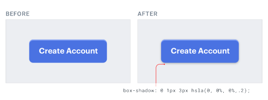

No te excedas con el radio de desenfoque, un par de píxeles es suficiente. Este tipo de sombras deberían tener bordes bastante nítidos — mira la sombra proyectada por la parte inferior de un tomacorriente o un marco de ventana como ejemplo del mundo real.

#### Elementos hundidos

Digamos que estás diseñando un componente "well" que debería sentirse como si estuviera empotrado en la página.

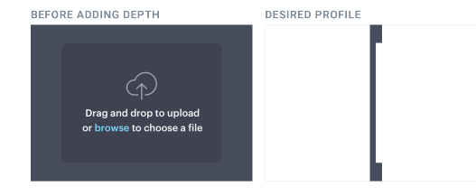

Mirando ligeramente hacia abajo, solo el borde inferior sería visible. Ya que mira hacia el cielo, dale a ese borde un color ligeramente más claro usando un borde inferior o una sombra interior con un desplazamiento vertical negativo:

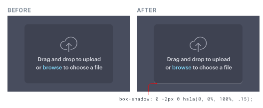

El área por encima del well debería bloquear parte de la luz que llega a la parte superior del well, así que añade una pequeña sombra interior oscura con un ligero desplazamiento vertical positivo para asegurarte de que no se filtre en la parte inferior:

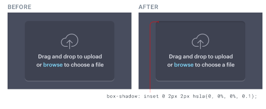

Este mismo tratamiento funciona para cualquier elemento que pueda necesitar verse hundido, por ejemplo los campos de texto y las casillas de verificación:

### No te excedas

Una vez que entiendes cómo simular la luz en una interfaz, puede ser tentador trastear durante horas, ajustando y ajustando para ver qué tan cerca puedes imitar el mundo real.

Aunque esto puede ser un ejercicio divertido, en la práctica puede llevar a interfaces que están recargadas y poco claras. Tomar prestadas algunas pistas visuales del mundo real es una gran manera de añadir un poco de profundidad, pero no hay necesidad de intentar hacer que las cosas se vean fotorrealistas.

## Usa las sombras para transmitir elevación

Las sombras pueden ser más que un simple efecto llamativo — usadas con consideración, te permiten posicionar elementos en un eje z virtual para crear un sentido significativo de profundidad.

Las sombras pequeñas con un radio de desenfoque ajustado hacen que un elemento se sienta solo ligeramente elevado del fondo, mientras que las sombras más grandes con un mayor radio de desenfoque hacen que un elemento se sienta mucho más cerca del usuario:

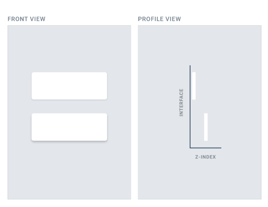

Cuanto más cerca se siente algo del usuario, más atraerá su atención.

Podrías usar una sombra más pequeña para algo como un botón, donde quieres que el usuario lo note pero no quieres que domine la página:

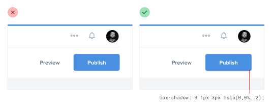

Las sombras medianas son útiles para cosas como los menús desplegables; elementos que necesitan sentarse un poco más arriba del resto de la interfaz:

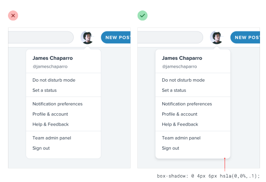

Las sombras grandes son geniales para los diálogos modales, donde realmente quieres capturar la atención del usuario:

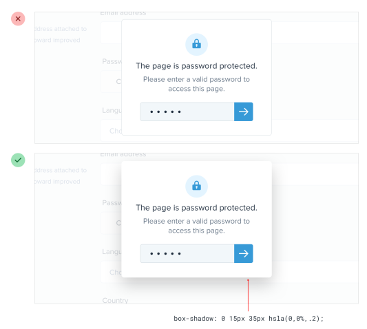

### Estableciendo un sistema de elevación

Al igual que con el color, la tipografía, el espaciado y el tamaño, definir un conjunto fijo de sombras acelerará tu flujo de trabajo y ayudará a mantener la consistencia en tus diseños.

No necesitas un montón de sombras diferentes — cinco opciones suele ser suficiente.

Comienza definiendo tu sombra más pequeña y tu sombra más grande, y luego llena el medio con sombras que aumenten de tamaño de manera bastante lineal:

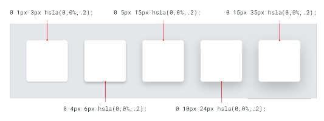

### Combinando sombras con la interacción

Las sombras no solo son útiles para posicionar elementos en el eje z estáticamente; también son una gran manera de proporcionar pistas visuales al usuario mientras interactúa con los elementos.

Por ejemplo, digamos que tenías una lista de elementos donde el usuario pudiera hacer clic y arrastrar cada elemento para ordenarlos. Añadir una sombra a un elemento cuando el usuario hace clic en él lo hace sentir como si saltara hacia adelante por encima de los otros elementos de la lista, y le deja claro al usuario que puede arrastrarlo:

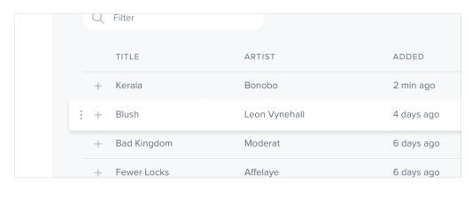

De manera similar, puedes hacer que un botón se sienta como si estuviera siendo presionado en la página cuando un usuario hace clic en él cambiando a una sombra más pequeña, o quizás eliminando la sombra por completo:

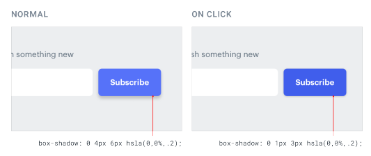

Usar las sombras de una manera significativa como esta es una gran manera de hackear el proceso de elegir qué tipo de sombra debería tener un elemento. No pienses en la sombra en sí, piensa en dónde quieres que el elemento se siente en el eje z y asígnale una sombra en consecuencia.

## Las sombras pueden tener dos partes

¿Alguna vez has inspeccionado una sombra realmente bonita en un sitio y has notado que en realidad estaban usando dos sombras?

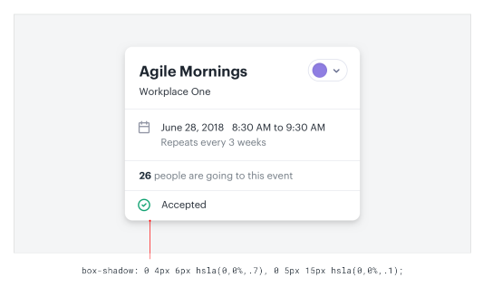

Hay un método en esta locura, y en realidad es bastante simple y tiene mucho sentido.

Cuando ves a alguien combinando dos sombras, no está experimentando aleatoriamente hasta que las cosas se vean bien, está usando cada sombra para hacer un trabajo específico.

La primera sombra es más grande y suave, con un desplazamiento vertical considerable y un gran radio de desenfoque. Simula la sombra proyectada detrás de un objeto por una fuente de luz directa.

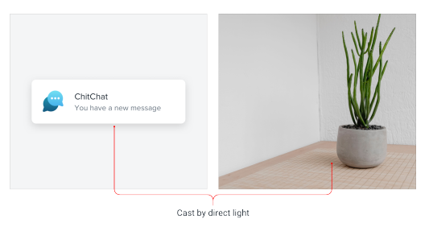

La segunda sombra es más ajustada y oscura, con menos desplazamiento vertical y un radio de desenfoque más pequeño. Simula el área sombreada debajo de un objeto donde incluso la luz ambiental tiene dificultades para llegar.

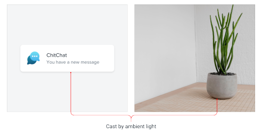

Usar dos sombras así te da mucho más control del que obtendrías con una sola sombra — puedes mantener la sombra más grande agradable y sutil mientras sigues haciendo que la sombra más cercana a los bordes del elemento esté bien definida.

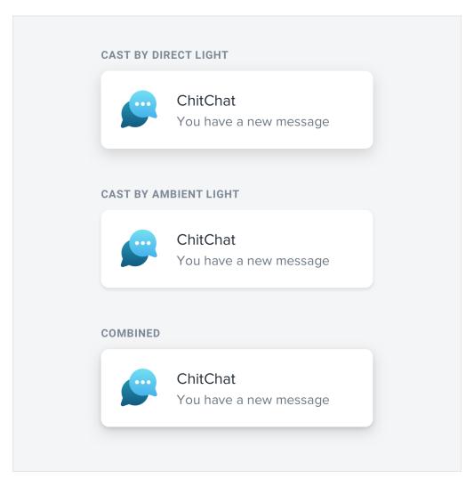

### Teniendo en cuenta la elevación

A medida que un objeto se aleja de una superficie, la pequeña sombra oscura creada por la falta de luz ambiental desaparece lentamente (ve y pruébalo con algo en tu escritorio).

Así que si vas a usar esta técnica de dos sombras en tus propios proyectos, asegúrate de hacer esa sombra más sutil para las sombras que representan una elevación más alta.

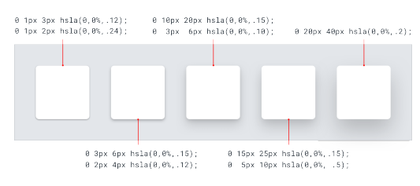

Debería ser bastante distintiva para tu elevación más baja, y casi (o completamente) invisible en tu elevación más alta.

## Incluso los diseños planos pueden tener profundidad

Cuando la mayoría de la gente habla de "diseño plano", se refiere a diseñar sin sombras, degradados o cualquier otro efecto que intente imitar cómo la luz interactúa con las cosas en el mundo real.

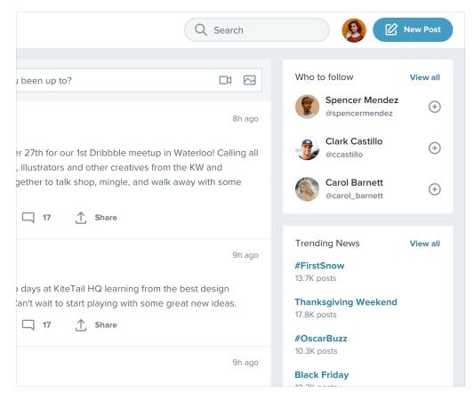

Pero los diseños planos más efectivos aún transmiten profundidad, solo lo hacen de una manera diferente.

### Creando profundidad con color

En general (especialmente con tonos del mismo color), los objetos más claros se sienten más cerca de nosotros y los objetos más oscuros se sienten más lejos.

Haz un elemento más claro que el color de fondo para que se sienta como si estuviera elevado de la página, o más oscuro que el color de fondo si quieres que se sienta hundido como un well:

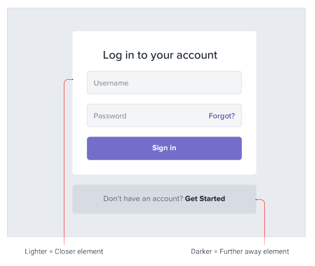

Esto también es aplicable a diseños no planos — el color es solo otra herramienta en tu cinturón de herramientas para transmitir distancia.

### Usando sombras sólidas

Otra manera de comunicar profundidad en un diseño plano es usar sombras cortas con desplazamiento vertical y sin radio de desenfoque.

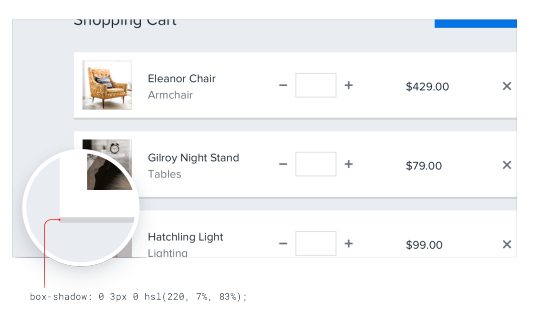

Es una excelente manera de hacer que una tarjeta o un botón se destaquen un poco de la página sin sacrificar esa estética plana.

## Superpón elementos para crear capas

Una de las maneras más efectivas de crear profundidad es superponer diferentes elementos para que el diseño se sienta como si tuviera múltiples capas.

Por ejemplo, en lugar de contener una tarjeta completamente dentro de otro elemento, desplázala para que cruce la transición entre dos fondos diferentes:

También podrías hacer un elemento más alto que su padre, para que se superponga en ambos lados:

Superponer elementos puede añadir profundidad a componentes más pequeños también, por ejemplo los controles de este carrusel:

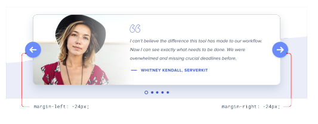

### Superponiendo imágenes

Esta técnica también puede funcionar muy bien con imágenes, pero sin consideración especial es fácil que las imágenes superpuestas choquen entre sí.

Un truco simple para evitar esto es darle a las imágenes un "borde invisible" — uno que coincida con el color de fondo — para que siempre haya un pequeño espacio entre las imágenes:

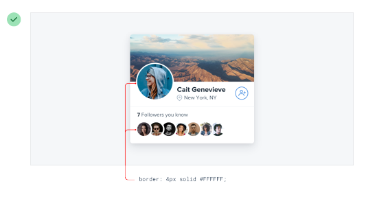

Todavía crearás la apariencia de capas pero sin ninguno de los choques feos.