# Trabajando con imágenes

## Usa buenas fotos

Las malas fotos arruinarán un diseño, incluso si todo lo demás se ve genial.

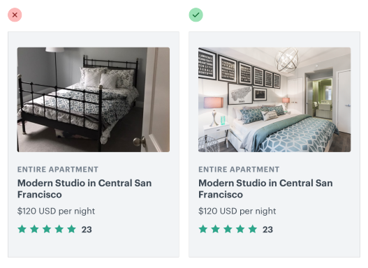

Si tu diseño necesita fotografía y no eres un fotógrafo talentoso, tienes dos opciones:

1. Contrata a un fotógrafo profesional.

    Si necesitas fotos muy específicas para tu proyecto, confía en un profesional. Tomar grandes fotos no se trata solo de usar una cámara cara, se trata de la iluminación, la composición, el color — habilidades que toman años en desarrollarse.

2. Usa fotografía de stock de alta calidad.

    Si tus necesidades son más genéricas, hay muchísimos grandes recursos donde puedes comprar excelentes fotos de stock. Incluso hay sitios como Unsplash que ofrecen fotografías hermosas de forma gratuita.

Hagas lo que hagas, no diseñes usando imágenes de relleno (placeholders) esperando poder tomar algunas fotos con tu smartphone y reemplazarlas más tarde. Nunca funciona.

## El texto necesita un contraste consistente

¿Alguna vez has intentado poner un titular sobre una gran imagen hero, solo para encontrar que sin importar qué color probaras para el texto, seguía siendo difícil de leer?

Eso es porque el problema no es el texto, es la imagen.

### El problema con las imágenes de fondo

Las fotos pueden ser muy dinámicas, con muchas áreas realmente claras y muchas áreas realmente oscuras. El texto blanco puede verse genial en las áreas oscuras, pero se pierde en las áreas claras. El texto oscuro se ve genial en las áreas claras, pero se pierde en las áreas oscuras.

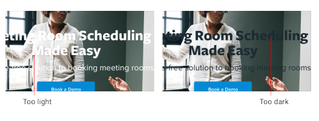

Para resolver este problema, necesitas reducir el dinamismo en la imagen para hacer que el contraste entre el texto y el fondo sea más consistente.

### Añade una superposición

Una manera de aumentar el contraste general del texto es añadir una superposición semi-transparente a la imagen de fondo.

Una superposición negra atenuará las áreas claras y ayudará a que el texto claro resalte, mientras que una superposición blanca iluminará las áreas oscuras y ayudará a que el texto oscuro resalte.

### Baja el contraste de la imagen

Uno de los compromisos que haces al usar una superposición es que estás aclarando u oscureciendo toda la imagen, no solo las áreas problemáticas.

Si quieres más control, otra solución es bajar el contraste de la propia imagen:

Bajar el contraste cambiará qué tan clara u oscura se siente la imagen en general, así que asegúrate de ajustar el brillo para compensarlo.

### Coloriza la imagen

Otra manera de ayudar a que el texto resalte contra una imagen es colorizar la imagen con un solo color.

Algún software de edición de fotos incluye esto como una función de primera clase, pero si el tuyo no lo hace, puedes crear este efecto en tres pasos:

1. Baja el contraste de la imagen, para equilibrar un poco las cosas.
2. Desatura la imagen, para eliminar cualquier color existente.
3. Añade un relleno sólido, usando el modo de fusión "multiply" (multiplicar).

Esto también puede ser una gran manera de hacer que una imagen de fondo combine más bonito con los colores de tu marca existente.

### Añade una sombra de texto

Si quieres preservar un poco más del dinamismo en una imagen de fondo, una sombra de texto puede ser una gran manera de aumentar el contraste solo donde más lo necesitas.

Quieres que se vea más como un resplandor sutil que como una sombra real, así que usa un gran radio de desenfoque y no añadas ningún tipo de desplazamiento.

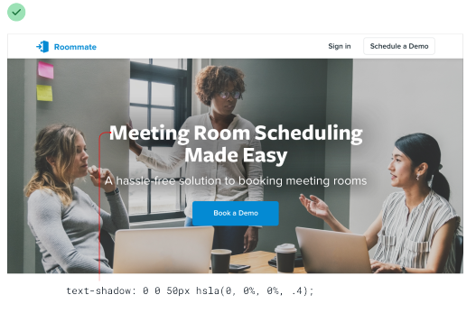

Sigue siendo una buena idea reducir el contraste general de la imagen, pero combinar eso con una sombra de texto significa que puedes reducirlo un poco menos.

## Todo tiene un tamaño previsto

Todos saben que escalar imágenes de mapa de bits más allá de su tamaño original es una mala idea — inmediatamente se sienten "borrosas" (fuzzy) y pierden su definición.

Pero esa no es la única manera en que puedes equivocarte con el escalado, incluso cuando crees que estás jugando seguro.

### No amplíes los iconos

Si estás diseñando algo que podría usar algunos iconos grandes (como quizás la sección de "características" de una página de aterrizaje), podrías instintivamente agarrar tu conjunto de iconos SVG favorito y aumentar el tamaño hasta que se ajuste a tus necesidades.

Son imágenes vectoriales después de todo, así que la calidad no va a sufrir si aumentas el tamaño, ¿verdad?

Aunque es cierto que las imágenes vectoriales no se degradarán en calidad cuando aumentes su tamaño, los iconos dibujados a 16–24px nunca se van a ver muy profesionales cuando los amplíes a 3x o 4x su tamaño previsto. Carecen de detalle, y siempre se sienten desproporcionadamente "toscos" (chunky).

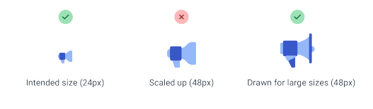

Si los iconos pequeños son todo lo que tienes, intenta encerrarlos dentro de otra forma y dándole a la forma un color de fondo:

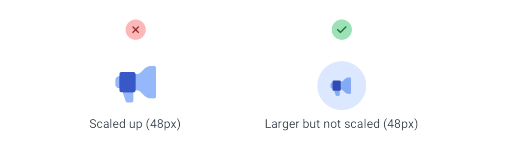

Esto te permite mantener el icono actual más cerca de su tamaño previsto, mientras sigues llenando el espacio más grande.

### No reduzcas las capturas de pantalla

Digamos que quieres incluir una captura de pantalla de tu app en esa misma página de características.

Si tomas una captura de pantalla de tamaño completo y la reduces en un 70% para que quepa, terminarás con una imagen que está tratando de meter demasiado detalle en muy poco espacio.

La fuente de 16px en tu app se convierte en una fuente de 4px en tu captura de pantalla, y los visitantes estarán entrecerrando los ojos a dos pulgadas de la pantalla, esforzándose por descifrar lo que dice todo ese texto.

Si quieres incluir una captura de pantalla detallada en tu diseño, toma la captura de pantalla a un tamaño de pantalla más pequeño (como quizás tu diseño de tableta) y guarda un montón de espacio para ella para que no tengas que reducirla tanto:

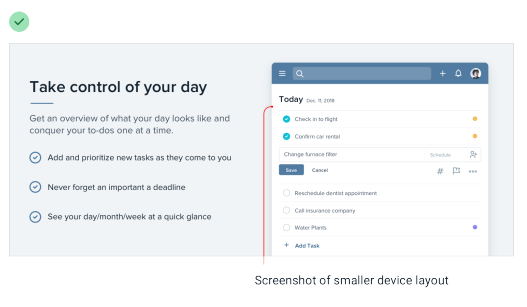

O considera tomar solo una captura de pantalla parcial, para que puedas mostrarla en menos espacio sin necesidad de reducirla:

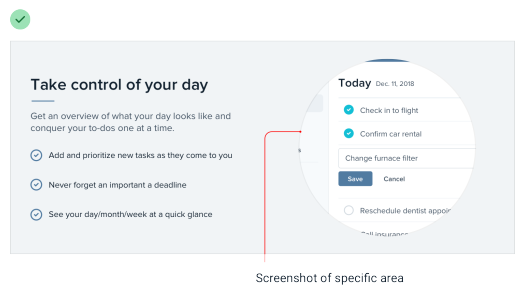

Si realmente necesitas meter una captura de pantalla de toda la app en un espacio reducido, intenta dibujar una versión simplificada de la interfaz con los detalles eliminados y el texto pequeño reemplazado por líneas simples:

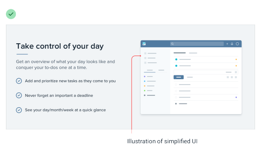

Seguirá comunicando el diseño a grandes rasgos sin tentar a los visitantes a intentar descifrar todos los detalles.

### Tampoco reduzcas los iconos

Así como los iconos dibujados para usarse a 16px se ven toscos cuando los amplías, los iconos destinados a usarse en tamaños más grandes se ven dentados y borrosos cuando los reduces.

El ejemplo más extremo de esto son los favicons, esos pequeños iconos que ves junto al título de la página en una pestaña del navegador.

Si intentas reducir un logo dibujado a 128px al tamaño de favicon, todo se convierte en papilla mientras el navegador hace todo lo posible por renderizar todo ese detalle en un diminuto cuadrado de 16px:

Un mejor enfoque es redibujar una versión súper simplificada del logo al tamaño objetivo, para que tú controles los compromisos en lugar de dejárselos al navegador:

## Cuidado con el contenido subido por los usuarios

Cuando dependes de imágenes subidas por los usuarios, no tienes el lujo de ajustar finamente el contraste, de ajustar cuidadosamente los colores, o de recortar el encuadre perfecto.

Aunque siempre estarás a merced de tus usuarios hasta cierto punto, hay algunas cosas que puedes hacer para asegurarte de que su contenido no socave por completo tu diseño.

### Controla la forma y el tamaño

Mostrar las imágenes subidas por los usuarios en su relación de aspecto intrínseca puede realmente desbaratar un layout, especialmente si hay muchas imágenes en la pantalla a la vez.

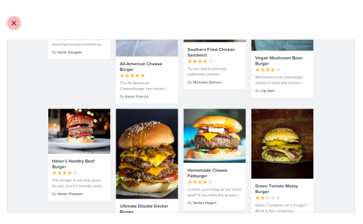

En lugar de dejar que los usuarios causen estragos en la estructura de tu página, centra sus imágenes dentro de contenedores fijos, recortando cualquier cosa que no quepa.

Esto es realmente fácil de hacer con CSS hoy en día haciendo que la imagen sea una imagen de fondo, y estableciendo la propiedad background-size en cover.

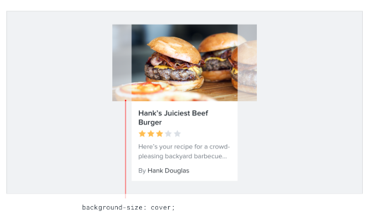

### Evita que el fondo se mezcle

Cuando un usuario proporciona una imagen con un color de fondo similar al fondo de tu interfaz, la imagen y el fondo pueden mezclarse (bleed), haciendo que la imagen pierda su forma.

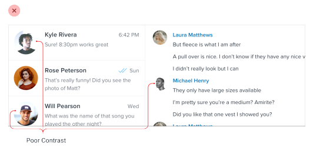

En lugar de intentar resolver esto con un borde, intenta usar una sombra interior (inset box shadow) sutil:

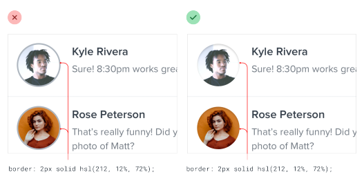

Los bordes a menudo chocarán con los colores de la imagen, mientras que la mayoría de la gente apenas se dará cuenta de que la sombra está ahí.

Si no te gusta el ligero aspecto "hundido" que obtienes al usar una sombra de caja (box shadow), un borde interior semi-transparente también funciona muy bien.

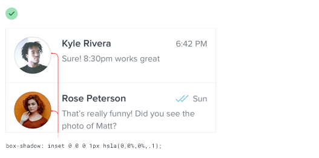