# Toques finales

## Potencia lo que ya existe

No siempre tienes que añadir nuevos elementos a un diseño para darle chispa — hay muchas maneras de darle vida a una página "potenciando" lo que ya está ahí.

Por ejemplo, si tu diseño incluye una lista con viñetas, intenta reemplazar las viñetas por iconos:

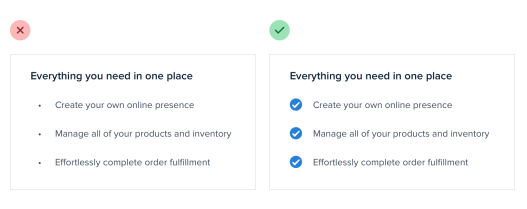

Las marcas de verificación y las flechas son excelentes opciones genéricas para muchas situaciones, pero también puedes usar algo más específico a tu contenido, como un icono de candado para una lista de características relacionadas con la seguridad:

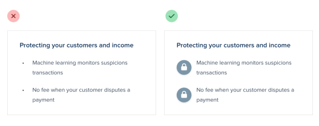

De manera similar, si estás trabajando en un testimonio, intenta "promocionar" las comillas a elementos visuales aumentando el tamaño y cambiando el color:

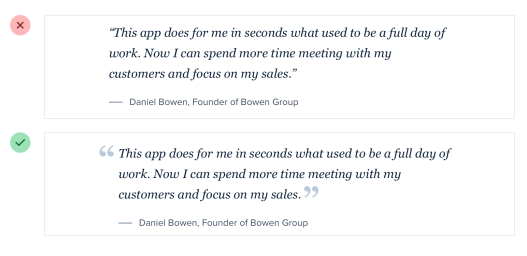

Los enlaces son otro gran candidato para un estilo especial. Puedes hacer algo tan simple como cambiar el color y el peso de la fuente, o algo tan elegante como un subrayado personalizado grueso y colorido que se superponga parcialmente al texto:

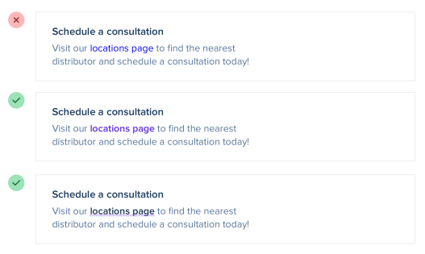

Si estás trabajando en un formulario, usar casillas de verificación y botones de radio personalizados es una manera fácil de añadir algo de color al diseño:

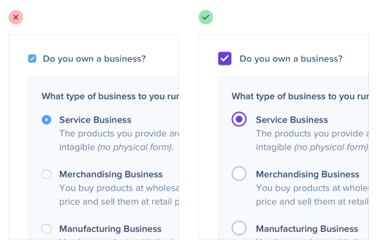

Solo usar uno de tus colores de marca para los estados seleccionados en lugar de los valores por defecto del navegador suele ser suficiente para llevar algo de sentirse aburrido a sentirse pulido y bien diseñado.

## Añade color con bordes de acento

Si no eres un diseñador gráfico, ¿cómo le añades ese toque de estilo visual a tu interfaz que otros diseños obtienen de la fotografía hermosa o de las ilustraciones coloridas?

Un truco simple que puede marcar una gran diferencia es añadir bordes de acento coloridos a partes de tu interfaz que de otra manera se sentirían un poco sosas.

Por ejemplo, a lo largo de la parte superior de una tarjeta:

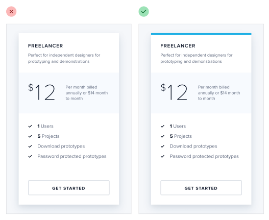

…o para resaltar los elementos de navegación activos:

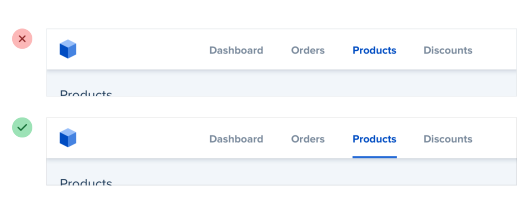

…o a lo largo del lateral de un mensaje de alerta:

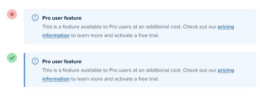

…o como un acento corto debajo de un titular:

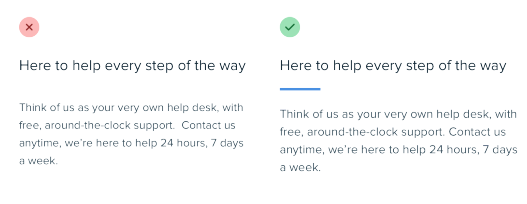

…o incluso a lo largo de la parte superior de todo tu layout:

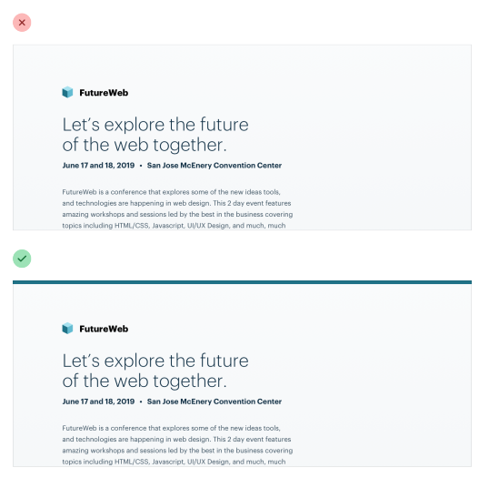

No requiere ningún talento de diseño gráfico añadir un rectángulo colorido a tu interfaz, y puede ayudar mucho a que algo se sienta más "diseñado".

## Decora tus fondos

Incluso si haces un gran trabajo con la jerarquía, el espaciado y la tipografía, a veces un diseño todavía se sentirá un poco plano.

Una gran manera de romper parte de la monotonía sin alterar drásticamente el diseño es añadir algo de emoción a unos cuantos de tus fondos.

### Cambia el color de fondo

Una manera de añadir algo de emoción a un fondo es simplemente cambiar el color.

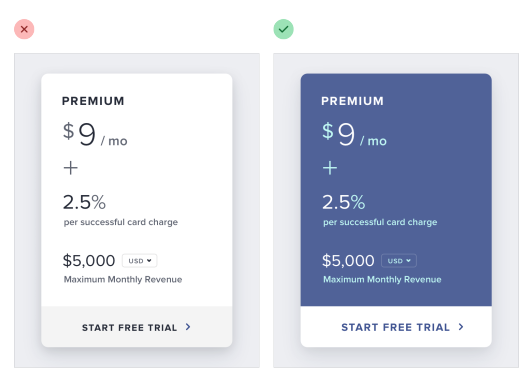

Esto funciona muy bien para enfatizar un panel individual, así como para añadir algo de distinción entre secciones completas de la página.

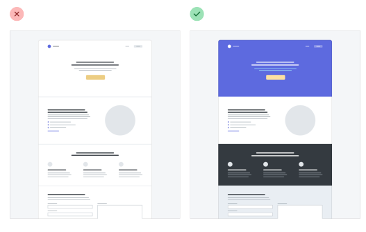

Para un aspecto más enérgico, incluso podrías usar un degradado sutil:

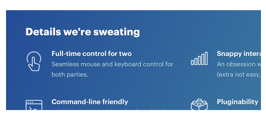

Para obtener los mejores resultados, usa dos tonos que no estén separados por más de aproximadamente 30°.

### Usa un patrón que se repita

Otro enfoque es añadir un patrón sutil que se pueda repetir, como este de Hero Patterns:

Tampoco tienes que repetirlo necesariamente en todo el fondo — un patrón diseñado para repetirse a lo largo de un solo borde puede verse genial también.

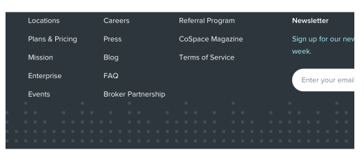

Mantén el contraste entre el fondo y el patrón bastante bajo para asegurar la legibilidad.

### Añade una forma simple o ilustración

En lugar de decorar un fondo completo, también puedes intentar incluir un gráfico individual o dos en posiciones específicas.

Las formas geométricas simples funcionan bien para esto:

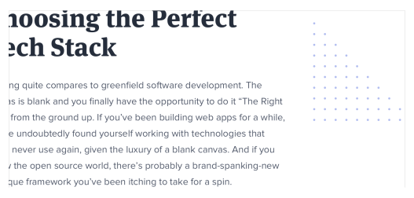

…así como los pequeños trozos de un patrón que se repite:

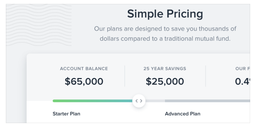

Incluso puedes hacer algo más complejo, como un mapamundi simplificado:

Al igual que con un patrón de fondo completo, es mejor mantener el contraste bajo para que nada interfiera con el contenido.

## No pases por alto los estados vacíos

Imagina que estás diseñando una nueva característica para una app en la que estás trabajando.

Has pasado un montón de tiempo creando los perfectos datos de muestra realistas, eligiendo nombres de usuario y avatares, y armando una pantalla hermosa y electrizante.

Lo codificas todo y lo despliegas a producción. Pero cuando un usuario emocionado hace clic en el nuevo elemento del menú de navegación, ve esto:

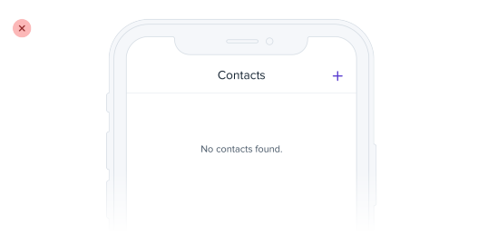

Si estás diseñando algo que depende del contenido generado por los usuarios, el estado vacío debería ser una prioridad, no un pensamiento de último momento.

Intenta incorporar una imagen o ilustración para captar la atención del usuario, y enfatiza el llamado a la acción para alentarlos a dar el siguiente paso:

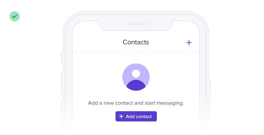

Si estás trabajando en algo que tiene un montón de interfaz de apoyo como pestañas o filtros, considera ocultar esas cosas por completo. No tiene sentido presentar un montón de acciones que no hacen nada hasta que el usuario haya creado algo de contenido.

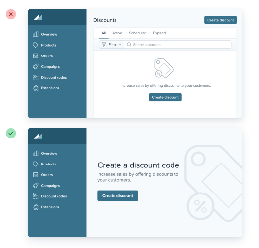

Los estados vacíos son la primera interacción de un usuario con un nuevo producto o característica. Úsalos como una oportunidad para ser interesante y emocionante — no te conformes con algo plano y aburrido.

## Usa menos bordes

Cuando necesitas crear separación entre dos elementos, intenta resistir la tentación de agarrar un borde inmediatamente.

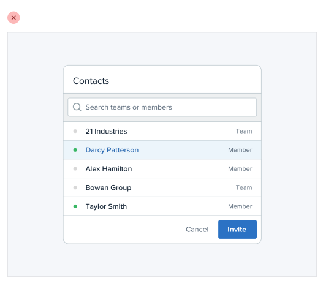

Aunque los bordes son una gran manera de distinguir dos elementos entre sí, no son la única manera, y usar demasiados puede hacer que tu diseño se sienta recargado y desordenado.

### Usa una sombra de caja

Las sombras de caja (box shadows) hacen un gran trabajo delineando un elemento como lo haría un borde, pero pueden ser más sutiles y lograr el mismo objetivo sin ser tan distractoras.

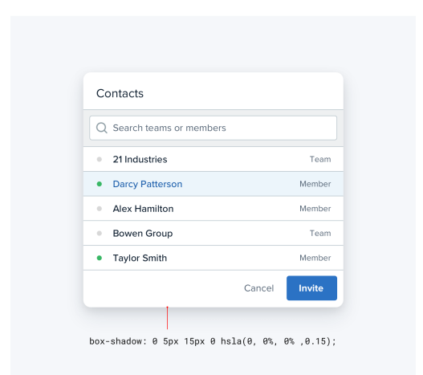

Este enfoque funciona mejor cuando el elemento al que le estás aplicando la sombra de caja no es del mismo color que el fondo.

### Usa dos colores de fondo diferentes

Dar a los elementos adyacentes colores de fondo ligeramente diferentes suele ser todo lo que necesitas para crear distinción entre ellos.

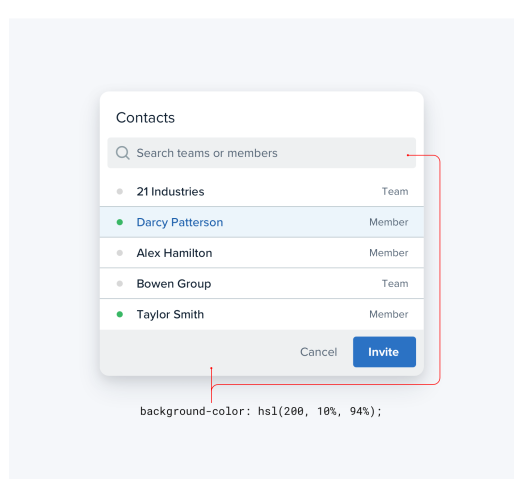

Si ya estás usando colores de fondo diferentes además de un borde, intenta eliminar el borde; puede que no lo necesites.

### Añade espacio extra

¿Qué mejor manera de crear separación entre elementos que simplemente aumentar la separación?

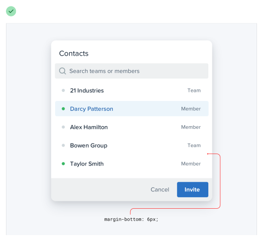

Espaciar las cosas más es una gran manera de crear distinción entre grupos de elementos sin introducir ninguna interfaz nueva.

## Piensa fuera de la caja

La mayoría de la gente tiene muchas ideas preconcebidas sobre cómo se supone que deben verse ciertos componentes. Pero solo porque hemos sido condicionados a creer que solo hay una manera de diseñar un componente en particular, no significa que sea verdad.

Por ejemplo, imagina un menú desplegable. Probablemente estés imaginando una caja blanca con un poco de sombra y una lista de enlaces apilados dentro:

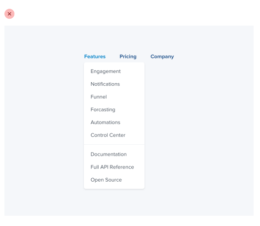

Pero, ¿quién dice que un menú desplegable tiene que ser una lista aburrida de enlaces? Es solo una caja flotante en la pantalla, puedes hacer cualquier cosa que quieras con él.

Dividelo en secciones, usa múltiples columnas, añade texto de apoyo o iconos coloridos — ¡haz algo divertido con él!

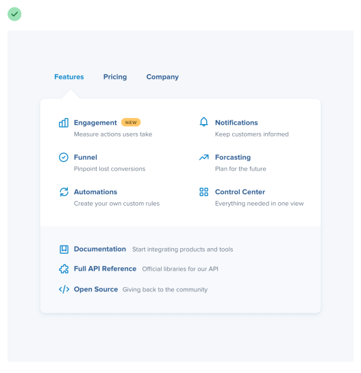

Y no te detengas solo en los menús desplegables; ¿qué tal algo como una tabla?

Cuando imaginas una tabla, probablemente piensas en columnas que cada una contiene un dato específico:

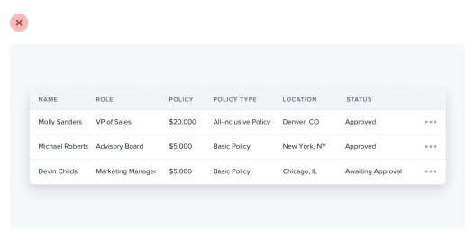

Las tablas no tienen que funcionar de esta manera, sin embargo — si una columna no necesita poder ordenarse, no hay razón para que no puedas combinarla con una columna relacionada e introducir alguna jerarquía interesante:

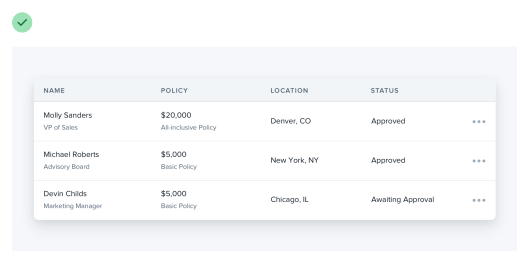

El contenido de la tabla tampoco tiene que ser texto plano. Añade imágenes si tiene sentido, o introduce algo de color para enriquecer los datos existentes:

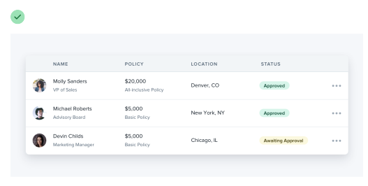

¿Qué tal los botones de radio? No hay nada más aburrido que una pila de etiquetas con pequeños círculos al lado.

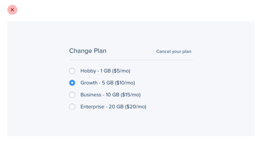

Si un conjunto de botones de radio es una parte importante de la interfaz que estás diseñando, intenta algo como tarjetas seleccionables en su lugar:

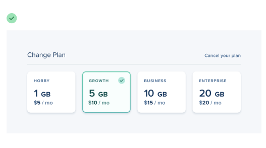

No dejes que tus creencias existentes frenen tus diseños — las restricciones son poderosas pero a veces un poco de libertad es justo lo que necesitas para llevar una interfaz al siguiente nivel.