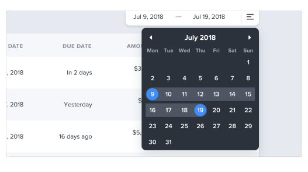
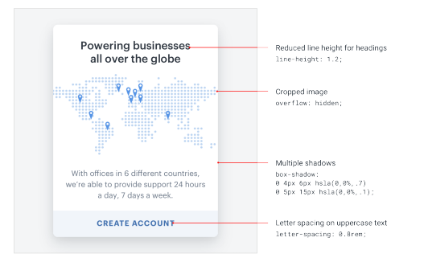

# Subiendo de nivel

## Subiendo de nivel

Esperemos que después de leer este libro te sientas mucho más seguro en tu capacidad de hacer que algo se vea increíble, sin depender de un diseñador. Pero aunque hemos hecho todo lo posible por meter todas las buenas ideas que pudimos pensar, siempre habrá más por aprender.

Aquí tienes dos de las mejores maneras de seguir perfeccionando tus habilidades y añadir nuevas herramientas a tu cinturón de herramientas.

### Busca decisiones que no habrías tomado

Siempre que te topes con un diseño que realmente te guste, pregúntate:

"¿Hizo el diseñador algo aquí que nunca se me habría ocurrido hacer por mi cuenta?"

Quizás es la manera en que invirtieron el color de fondo en un selector de fecha:

…o la manera en que posicionaron un botón dentro de un campo de texto en lugar de afuera:

…o algo tan simple como usar dos colores de fuente diferentes para un titular:

Prestar atención a este tipo de decisiones poco intuitivas es una gran manera de descubrir nuevas ideas que puedes aplicar a tus propios diseños.

### Reconstruye tus interfaces favoritas

La mejor manera absoluta de notar los pequeños detalles que hacen que un diseño se vea realmente pulido es recrear ese diseño desde cero, sin mirar las herramientas de desarrollo.

Cuando estás tratando de averiguar por qué tu versión se ve diferente del original, descubrirás trucos como "reduce la altura de línea para los titulares", "añade letter-spacing al texto en mayúsculas" o "combina múltiples sombras" todo por tu cuenta.

Al estudiar continuamente el trabajo que te inspira con un ojo atento, estarás aprendiendo trucos de diseño durante los próximos años.

— Adam Wathan & Steve Schoger